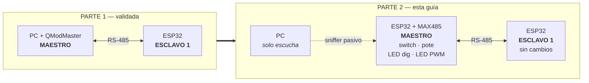

# PARTE 2 — Comunicación bidireccional con maestro MODBus monoesclavo

**Tarea Nº1** · Protocolos de Comunicaciones Industriales · UNRaf
**Autores:** Bevilacqua Francisco, Peralta Agustina

Guía de ejecución de banco de la Parte 2: la PC deja de ser el maestro y ese rol
pasa a un segundo ESP32. Continúa a [PARTE-1.md](PARTE-1.md), que se da por
completada y validada.

---

## Índice

1. [Objetivo y criterio de terminado](#1-objetivo-y-criterio-de-terminado)
2. [Qué cambia respecto de la Parte 1](#2-qué-cambia-respecto-de-la-parte-1)
3. [La regla que domina toda la Parte 2: un solo maestro](#3-la-regla-que-domina-toda-la-parte-2-un-solo-maestro)
4. [Decisiones de banco propias de la Parte 2](#4-decisiones-de-banco-propias-de-la-parte-2)
5. [Lista de materiales](#5-lista-de-materiales)
6. [Conexiones de hardware del maestro](#6-conexiones-de-hardware-del-maestro)
7. [Archivos involucrados](#7-archivos-involucrados)
8. [Paso a paso de resolución](#8-paso-a-paso-de-resolución)
9. [Uso de QModMaster en la Parte 2](#9-uso-de-qmodmaster-en-la-parte-2)
10. [Capturar el diálogo maestro↔esclavo](#10-capturar-el-diálogo-maestroesclavo)
11. [Qué datos registrar y de qué manera](#11-qué-datos-registrar-y-de-qué-manera)
12. [Checklist de validación](#12-checklist-de-validación)
13. [Evidencia a capturar para el informe](#13-evidencia-a-capturar-para-el-informe)
14. [Diagnóstico de fallas](#14-diagnóstico-de-fallas)
15. [Banco de preguntas de defensa](#15-banco-de-preguntas-de-defensa)

---

## 1. Objetivo y criterio de terminado

La consigna pide tres cosas:

| # | Consigna | Cómo se cumple |
|---|---|---|
| 1 | Segundo ESP32 + MAX485 operando como **maestro** MODBus RTU | [firmware/maestro/main.py](firmware/maestro/main.py) |
| 2 | Maestro con 1 switch, 1 potenciómetro, 1 LED digital y 1 LED PWM locales | §6 |
| 3 | Intercambio bidireccional por sondeo periódico | §11 y el ciclo de 4 transacciones |

**La lógica de intercambio, textual de la consigna:**

| Sentido | Qué hace |
|---|---|
| **Lectura y replicación** | Leer el switch y el potenciómetro **del Esclavo 1** y reflejarlos en el LED digital y el LED PWM **locales del maestro** |
| **Escritura de comandos** | Leer el switch y el potenciómetro **locales del maestro** y escribirlos en el Coil y el Holding Register **del Esclavo 1** |

Los dos sentidos ocurren en el mismo ciclo. De ahí el nombre: comunicación
**bidireccional**.

**Definition of Done de la Parte 2** — no se pasa a la Parte 3 sin esto:

- [ ] Las 14 pruebas del checklist de §12 pasan y están anotadas.
- [ ] Sondeo estable **5 minutos continuos** con tasa de error registrada.
- [ ] Tabla de correspondencia local↔remota completa en los dos sentidos (§11).
- [ ] Tiempo de ciclo medido y **comparado contra los 102 ms teóricos**.
- [ ] Captura del sniffer con un ciclo completo de 4 transacciones (8 tramas).

## 2. Qué cambia respecto de la Parte 1



| Aspecto | Parte 1 | Parte 2 |
|---|---|---|
| **Quién inicia las transacciones** | La PC (QModMaster) | El **ESP32 maestro** |
| Rol de la PC | Maestro | **Observador pasivo** o herramienta de verificación offline |
| Nodos activos en el bus | 2 | 2 (+1 si se deja el adaptador escuchando) |
| Firmware del esclavo | — | **Sin un solo cambio** |
| Quién decide qué se escribe | Un humano, valor por valor | El maestro, automáticamente, 5 veces por segundo |
| Periodicidad | Manual | **Sondeo cada 200 ms** |
| Evidencia de tramas | Bus Monitor de QModMaster | [sniffer_rs485.py](herramientas/sniffer_rs485.py) |

**Lo que NO cambia y por eso no vuelve a ser sospechoso:** el mapa de registros,
los parámetros serie, la adaptación de niveles, el firmware del esclavo y el
cableado del Esclavo 1. Todo eso quedó validado en la Parte 1. Cualquier problema
nuevo se atribuye al nodo nuevo — que es exactamente el valor de haber aislado la
etapa anterior.

## 3. La regla que domina toda la Parte 2: un solo maestro

> ⚠️ **MODBus RTU admite un único maestro por bus. Nunca dos.**

No es una recomendación de estilo: es estructural. El protocolo no tiene ningún
mecanismo de arbitraje porque no lo necesita — **el turno de palabra lo otorga el
maestro al dirigir la petición**. Con dos iniciadores, ese supuesto se rompe:

```
Maestro ESP32  ──► 01 04 00 00 00 01 ...   ┐
                                            ├── se superponen en el mismo par A/B
QModMaster     ──► 01 03 00 00 00 01 ...   ┘

Resultado: el esclavo recibe una mezcla de las dos tramas, el CRC falla,
descarta todo en silencio, y AMBOS maestros reportan timeout.
```

El síntoma es desconcertante: cada maestro por separado funciona, juntos no
funciona ninguno, y el bus parece "roto" sin que haya nada roto.

**Las tres formas correctas de usar QModMaster en la Parte 2:**

| Modo | Cuándo | ESP32 maestro |
|---|---|---|
| **Pre-validación** | Antes de encender el maestro, para confirmar que el esclavo sigue sano | Apagado o desconectado del bus |
| **Verificación de estado** | Después de detener el maestro, para leer qué quedó escrito en Coil y HR | Detenido con Ctrl+C |
| **Escucha pasiva** | Durante el sondeo, para capturar tramas | Corriendo — pero se usa el **sniffer**, no QModMaster (§10) |

**Modo prohibido:** QModMaster con `Scan` activo mientras el ESP32 maestro
sondea. Ver §14.1.

## 4. Decisiones de banco propias de la Parte 2

### 4.1 Potenciómetro de 2,2 kΩ en el maestro — sin cambios de firmware

El Esclavo 1 usa el de 10 kΩ (Parte 1) y el maestro usa el de **2,2 kΩ**.

> **No hace falta modificar ni una línea de código.** El potenciómetro es un
> **divisor de tensión**: lo que llega al ADC depende de la *relación* entre sus
> dos mitades, no de su resistencia total. Con el cursor a la mitad, tanto un
> potenciómetro de 2,2 kΩ como uno de 10 kΩ entregan 1,65 V a partir de 3,3 V.
> El ADC lee 0-4095 en ambos casos, y `config.ADC_MAXIMO = 4095` describe los
> **12 bits del conversor**, no el componente conectado.

Lo que sí cambia son dos parámetros eléctricos, y ninguno para peor:

| Parámetro | 10 kΩ (Esclavo 1) | **2,2 kΩ (Maestro)** | Efecto |
|---|---|---|---|
| Corriente consumida | 3,3 V / 10 kΩ = 0,33 mA | 3,3 V / 2,2 kΩ = **1,5 mA** | 4,5 veces más, sigue siendo despreciable |
| Impedancia de fuente vista por el ADC (peor caso: cursor al medio, R/4) | 2,5 kΩ | **550 Ω** | **Mejor**: el condensador de muestreo del ADC SAR se carga más rápido y completo |

**El de 2,2 kΩ es, de hecho, la mejor entrada de las dos.** El ADC del ESP32
muestrea cargando un condensador interno a través de la impedancia de la fuente;
cuanto menor sea esa impedancia, menor el error de muestreo. A 550 Ω el ADC opera
con holgura.

**Trade-off explícito:** se gasta 1,17 mA más. Sobre un nodo alimentado por USB
que consume unos 60 mA, es el 2 %: irrelevante. En un nodo a batería la decisión
sería la inversa, y ahí sí convendría el de 10 kΩ o incluso uno de 100 kΩ con un
buffer.

**Consecuencia práctica:** el promediado de 8 muestras (`config.MUESTRAS_ADC`)
se mantiene sin cambios. Si acaso, con menor impedancia de fuente el ruido baja y
el promediado es más efectivo.

### 4.2 El selector GPIO13 queda sin conectar

El firmware del maestro ya implementa la selección dinámica de esclavo de la
Parte 3. Para la Parte 2, **monoesclavo**, se deja `GPIO13` **sin conectar**:

| Estado de GPIO13 | Lectura | Esclavo destino |
|---|---|---|
| **Sin conectar (abierto)** | 1 | **Esclavo 1** ← lo que necesita la Parte 2 |
| Puenteado a GND | 0 | Esclavo 2 (Parte 3) |

El pull-up interno lo deja en alto y el maestro dirige el 100 % de sus
transacciones al Unit ID 1. **Cero componentes, cero cambios de código.**

Es la ventaja de haber diseñado la máquina de estados completa desde el
principio: la Parte 2 es la Parte 3 con el selector fijo en una posición.

### 4.3 Los LED indicadores (GPIO22 y GPIO23) son opcionales acá

Pertenecen a la Parte 3 (indicación visual de cuál esclavo está activo). En la
Parte 2 el LED indicador 1 quedaría permanentemente encendido y el 2 apagado, lo
que no aporta información.

**Recomendación: montarlos igual.** Cuestan dos LED y dos resistencias, sirven
como testigo de que la máquina de estados está girando, y evitan volver a tocar
la protoboard cuando arranque la Parte 3. Si el firmware escribe en esos pines y
no hay LED conectados tampoco pasa nada: el pin simplemente conmuta.

### 4.4 Terminación y polarización: ahora sí hay que medir y decidir

La Parte 1 fue sin terminación ni polarización, con justificación numérica
([PARTE-1.md §3.1](PARTE-1.md#31-sin-resistencias-de-terminación)): el bus de
2 nodos y menos de 60 cm no alcanzaba la longitud crítica.

En la Parte 2 el bus crece. **El criterio no cambia, cambia la medición:**

```
Longitud crítica con tR típico del MAX485 (15 ns):
    L_c = tR × v / 2 = 15 ns × 2×10⁸ m/s / 2 = 1,5 m
```

| Longitud total A/B medida | Decisión |
|---|---|
| **< 1 m** | Sin terminación ni polarización. Es el caso más probable en protoboard |
| 1 a 1,5 m | Zona gris: **empezar sin**, y agregar solo si la tasa de error lo justifica |
| **> 1,5 m** | Instalar 120 Ω en los dos extremos **junto con** la polarización de 680 Ω |

> **Ahora se puede decidir con datos, no por corazonada.** La instrumentación
> agregada al maestro (§11.3) reporta la tasa de error cada 5 segundos. El
> criterio operativo es: si tras **5 minutos** de sondeo continuo la línea
> `[MAESTRO]` sigue mostrando `fallos=0 (0.0%)`, el bus no necesita terminación
> y eso queda documentado con una medición, que es mucho más defendible que
> "le puse las resistencias porque el libro dice".

> ⚠️ **Terminación y polarización van juntas.** Poner los 120 Ω sin la red de
> 680 Ω deja A y B unidas por 60 Ω y la tensión diferencial de reposo en ≈0 V,
> dentro de la zona muerta de ±200 mV: el bus queda **peor** que sin terminar.
> Ver [arquitectura.md §6](docs/arquitectura.md#6-polarización-de-reposo-fail-safe-biasing).

**Disposición física del bus:**

```
   [MAESTRO]                                    [ESCLAVO 1]
       │                                             │
       │  stub < 30 cm                  stub < 30 cm │
  ═════╧═════════════════════╤═══════════════════════╧═════  A
                             │
  ═══════════════════════════╪═════════════════════════════  B
                             │
                     stub corto (opcional)
                             │
                      [USB-RS485]
                    solo escuchando

       GND ────── común a los tres nodos ──────
```

Los dos ESP32 son los extremos eléctricos. El adaptador USB, si se deja para
capturar tramas, va como **derivación corta en el medio**, nunca en un extremo.

## 5. Lista de materiales

Todo lo de la Parte 1, más:

| Componente | Cantidad | Valor | Función |
|---|---|---|---|
| ESP32 DevKit | 1 | — | Nodo maestro |
| Módulo MAX485 | 1 | — | Transceptor del maestro |
| Potenciómetro | 1 | **2,2 kΩ** | Entrada analógica local → HR del esclavo |
| Pulsador | 1 | — | Entrada digital local → Coil del esclavo |
| LED | 2 | — | Replicador digital y replicador PWM |
| LED | 2 | — | Indicadores de selección (opcionales, §4.3) |
| Resistencia | 2 o 4 | 330 Ω | Limitadoras de los LED |
| Resistencia | 1 | 2,2 kΩ | R1 del divisor RO→RX |
| Resistencia | 1 | 3,3 kΩ | R2 del divisor RO→RX |
| Resistencia | 1 | **680 Ω** | **Pull-up de RO — obligatorio, ver §6.4** |
| Resistencia | 2 | 120 Ω | Terminación — **solo si §4.4 lo indica** |
| Resistencia | 2 | 680 Ω | Polarización — **solo junto con la terminación** |
| **Protoboard 16 × 5,5 cm** | **1** | 830 contactos | Nodo maestro (la #1 ya está ocupada por el Esclavo 1) |
| Cables dupont macho-macho | ~20 | cortos | Conexionado sobre la protoboard |
| Cables dupont hembra-macho | 12 | — | Alternativa si el DevKit no entra cómodo en la protoboard |

> **Inventario de protoboards:** con 2 placas se cubre la Parte 2 completa (una
> por nodo). La tercera hace falta recién para el Esclavo 2 de la Parte 3.

Valores alternativos de resistencias en
[PARTE-1.md §4.1 y §4.2](PARTE-1.md#41-si-no-tenés-exactamente-22-kω-y-33-kω-divisor-rorx).

## 6. Conexiones de hardware del maestro

> ⚠️ **Armar todo con la alimentación desconectada.** Conectar el USB recién al
> terminar el Paso 2 de §8.

### 6.1 Dos protoboards, una por nodo

| Protoboard | Nodo | Estado |
|---|---|---|
| **#1** | Esclavo 1 | ✅ Ya montada y validada en la Parte 1 — **no se toca** |
| **#2** | Maestro | ⬜ Se monta en esta parte |
| #3 (a conseguir) | Esclavo 2 | Parte 3 |

Una protoboard por nodo, y no una sola compartida, porque cada nodo debe poder
desconectarse del bus sin desarmar nada — es justo lo que exige la prueba 12 del
checklist de §12 (desconectar el esclavo con el maestro corriendo).

### 6.2 Tabla completa de conexiones

| # | Desde | Hacia | Componente intermedio |
|---|---|---|---|
| 1 | ESP32 **GPIO17** | MAX485 **DI** | — (directo) |
| 2 | MAX485 **RO** | ESP32 **GPIO16** | **Divisor 2,2 k / 3,3 k** ⚠️ |
| 3 | ESP32 **GPIO4** | MAX485 **DE** *y* **RE** (unidos) | — (directo) |
| 4 | ESP32 **VIN (5 V)** | MAX485 **VCC** | — |
| 5 | ESP32 **GND** | MAX485 **GND** | — |
| 6 | MAX485 **A** | Línea A del bus | dupont trenzado a mano |
| 7 | MAX485 **B** | Línea B del bus | dupont trenzado a mano |
| 8 | ESP32 **GND** | GND del Esclavo 1 | ⚠️ **imprescindible** |
| 9 | ESP32 **GPIO18** | Pulsador → GND | — (pull-up interno) |
| 10 | ESP32 **3V3** | Potenciómetro **2,2 kΩ** extremo 1 | — |
| 11 | ESP32 **GND** | Potenciómetro **2,2 kΩ** extremo 2 | — |
| 12 | Potenciómetro **cursor** | ESP32 **GPIO34** | — |
| 13 | ESP32 **GPIO19** | LED replicador digital, ánodo | 330 Ω hacia GND |
| 14 | ESP32 **GPIO21** | LED replicador PWM, ánodo | 330 Ω hacia GND |
| 15 | ESP32 **GPIO22** | LED indicador Esclavo 1, ánodo *(opcional)* | 330 Ω hacia GND |
| 16 | ESP32 **GPIO23** | LED indicador Esclavo 2, ánodo *(opcional)* | 330 Ω hacia GND |
| 17 | ESP32 **GPIO13** | *sin conectar* | fija destino = Esclavo 1 |

**Las filas 1 a 14 son idénticas a las del Esclavo 1** (comparar contra
[PARTE-1.md §5.1](PARTE-1.md#51-tabla-completa-de-conexiones)). Es deliberado:
reduce errores de cableado y permite que ambos firmwares compartan
`perifericos.py` sin ninguna diferencia.

### 6.3 Interfaz ESP32 ↔ MAX485

Idéntica a la del Esclavo 1 — es el mismo módulo con las mismas restricciones
eléctricas, en una placa distinta.

```
        ESP32                                    MAX485
  ┌───────────────┐                        ┌──────────────┐
  │               │                        │              │
  │  GPIO17 (TX)  ├───────────────────────►│ DI    (4)    │
  │               │        directo         │              │
  │               │                        │              │
  │  GPIO4        ├────────────┬──────────►│ DE    (3)    │        A (6) ──► al bus
  │               │  directo   └──────────►│ RE    (2)    │        B (7) ──► al bus
  │               │                        │              │
  │  GPIO16 (RX)  │◄────┬──────────────────┤ RO    (1)    │
  │               │     │      2,2 kΩ      │              │
  │               │  3,3 kΩ                │              │
  │               │     │                  │              │
  │      GND      ├─────┴──────────────────┤ GND   (5)    │
  │               │                        │              │
  │      VIN      ├───────────────────────►│ VCC   (8)    │
  └───────────────┘                        └──────────────┘
```

**Por qué DI, DE y RE van directos:** el MAX485 necesita **VIH ≥ 2,0 V** y el
ESP32 entrega 3,3 V. Margen de 1,3 V, de sobra.

**Por qué RO necesita divisor:** RO entrega **VOH ≥ 3,5 V**, en la práctica casi
VCC (≈5 V), contra un **máximo absoluto de 3,6 V** en el GPIO del ESP32. Es una
placa nueva: el error se puede repetir si se apura el montaje.

**Por qué DE y RE se unen:** un solo GPIO controla las dos funciones de forma
coherente y es imposible dejar el nodo transmitiendo y escuchando a la vez.

### 6.4 Detalle del divisor en protoboard

```
                        5 V
                         │
                    [ 680 Ω ]   ← pull-up: OBLIGATORIO, ver abajo
                         │
   MAX485 RO ────────────┴──[ 2,2 kΩ ]────┬──── ESP32 GPIO16
                                          │
                                     [ 3,3 kΩ ]
                                          │
                                         GND
```

El punto de unión de la 2,2 kΩ con la 3,3 kΩ es el que va al GPIO16. Es el nodo
que se mide en el Paso 2 del §8.

#### Por qué el pull-up de 680 Ω no es opcional

Del datasheet del MAX485: *"RO is high impedance when RE is high"*. Como RE está
atado a DE, **mientras el nodo transmite su propio RO queda en alta impedancia**
— no conduce nada.

Sin pull-up, en ese momento el divisor se vuelve en contra: la 3,3 kΩ tira el
GPIO16 a masa. Para el UART, RX en bajo es un bit de arranque, y si sigue en
bajo produce **bytes `0x00` espurios, uno tras otro**, durante toda la
transmisión. Esos bytes quedan en el buffer de recepción del propio nodo.

Las consecuencias son distintas según el rol, y las dos son graves:

| Nodo | Qué provoca |
|---|---|
| **Maestro** | Al terminar de transmitir llama enseguida a leer la respuesta, encuentra los `0x00` en su buffer, los toma por la respuesta del esclavo y falla el CRC. **En el 100 % de los ciclos**, con o sin esclavo conectado |
| **Esclavo** | Los `0x00` de su propia respuesta quedan en el buffer y se **concatenan** con la siguiente petición si esta llega dentro de los 4 ms de `inter_frame_delay`. La trama unida falla el CRC y la librería la descarta con `return None`, **sin lanzar excepción**: el esclavo simplemente no responde y su consola queda limpia |

El síntoma en el esclavo es especialmente engañoso porque es **selectivo**: las
peticiones que llegan tras un silencio largo (el período de sondeo) se atienden
bien, y las que llegan pegadas a su transmisión anterior se pierden. En la
práctica eso se ve como "la primera transacción del ciclo funciona y la segunda
da timeout".

> **Los tutoriales que conectan RO directo al GPIO no sufren esto**: sin
> divisor, el pull-up interno del ESP32 sostiene la línea en alto cuando RO
> flota. El divisor es necesario para proteger el pin de los 5 V, pero
> introduce este modo de falla si no se lo acompaña con el pull-up.

#### Valores válidos

El pull-up tiene que sostener el nodo por encima del umbral de entrada alta del
ESP32 (0,75 × 3,3 V = **2,47 V**) mientras RO está en Hi-Z:

| Pull-up | V en el nodo con RO en Hi-Z | Corriente con RO en bajo | Veredicto |
|---|---|---|---|
| 470 Ω | 2,76 V | 9,8 mA | Sirve |
| **680 Ω** | **2,67 V** | **6,8 mA** | **Recomendado** |
| 1 kΩ | 2,54 V | 4,6 mA | Sirve, margen ajustado |
| 1,5 kΩ | 2,36 V | 3,1 mA | ✗ Por debajo del umbral |
| 10 kΩ | 1,06 V | 0,5 mA | ✗ Muy insuficiente |

Verificación de los otros dos estados con 680 Ω: con RO conduciendo en bajo el
nodo queda en 0,24 V (BAJO correcto) y con RO conduciendo en alto en 2,70 V
(ALTO correcto). El pull-up no interfiere con la operación normal.

⚠️ **Va en los tres nodos.** Cualquier nodo que transmita —y todos transmiten—
tiene este problema.

### 6.5 Pulsador local → escribe el Coil del esclavo

```
   ESP32 GPIO18 ──────┬──────  pin 1 del pulsador
                      │
              (pull-up interno,
               activado por software)

                pin 2 del pulsador ────── GND
```

Mismo circuito que el switch de la Parte 1. La diferencia está en qué hace el
firmware con la lectura: acá **no** alimenta un Discrete Input propio, sino que
se envía por el bus con la función 0x05 hacia el Coil del Esclavo 1 (ver §6.11).

No hace falta resistencia externa: el pull-up del ESP32 (≈45 kΩ) ya lo resuelve.

### 6.6 Potenciómetro de 2,2 kΩ → escribe el Holding Register del esclavo

```
   ESP32 3V3 ──────── extremo 1
                          │
                        ┌─┴─┐
                        │   │◄──── cursor ──── ESP32 GPIO34
                        └─┬─┘   (2,2 kΩ)
                          │
   ESP32 GND ──────── extremo 2
```

⚠️ **Alimentar con 3V3, nunca con 5 V ni con VIN.** GPIO34 admite hasta 3,3 V.

El potenciómetro es un divisor de tensión: lo que llega al ADC depende de la
*relación* entre sus dos mitades, no de la resistencia total. Con el cursor a la
mitad, el de 2,2 kΩ entrega 1,65 V igual que el de 10 kΩ del Esclavo 1 — ver la
justificación completa en §4.1.

**Verificación rápida con multímetro** antes de conectar el cursor al GPIO:
girando el potenciómetro de tope a tope, la tensión del cursor debe recorrer de
≈0 V a ≈3,3 V de forma continua.

### 6.7 LEDs replicadores → reflejan las entradas del esclavo

```
   ESP32 GPIO19 ────►│──── [ 330 Ω ] ──── GND      LED digital · refleja DI 10001
                    LED                              del Esclavo 1 (función 0x02)

   ESP32 GPIO21 ────►│──── [ 330 Ω ] ──── GND      LED PWM · refleja IR 30001
                    LED                              del Esclavo 1 (función 0x04)
```

El ánodo (pata larga) va al GPIO; el cátodo (pata corta) al lado de la
resistencia. Si un LED no enciende nunca, invertirlo es lo primero a probar.

> **Estos LEDs no reflejan nada local.** El LED de GPIO19 se enciende cuando se
> presiona el pulsador **del esclavo**, no el propio — ver §6.11.

### 6.8 LEDs indicadores de selección (opcionales en esta parte)

```
   ESP32 GPIO22 ────►│──── [ 330 Ω ] ──── GND      Indicador "hablando con Esc. 1"
                    LED

   ESP32 GPIO23 ────►│──── [ 330 Ω ] ──── GND      Indicador "hablando con Esc. 2"
                    LED
```

Pertenecen a la selección dinámica de la Parte 3. Acá el firmware los enciende
igual (la máquina de estados ya los gestiona), pero con un solo esclavo
conectado el indicador 1 queda fijo y el 2 apagado: no aportan información
todavía. Montarlos ahora evita volver a tocar la protoboard en la Parte 3, pero
es opcional — si no hay LEDs disponibles, el firmware funciona igual con esos
pines sin conectar.

### 6.9 Selector de esclavo — no se conecta nada

`GPIO13` se lee al arrancar (y en cada ciclo) con pull-up interno:

| Estado de GPIO13 | Lectura | Esclavo destino |
|---|---|---|
| **Sin conectar (abierto)** | 1 | **Esclavo 1** ← lo que necesita la Parte 2 |
| Puenteado a GND | 0 | Esclavo 2 (Parte 3) |

**Para la Parte 2 no se conecta ningún componente a GPIO13.** El pull-up interno
lo deja en alto y el maestro dirige el 100 % de sus transacciones al Unit ID 1.
Cero componentes, cero cambios de código: es la ventaja de haber diseñado la
máquina de estados completa (Parte 3) desde el principio.

### 6.10 Unión entre las dos protoboards

```
   Protoboard #2 (maestro)                   Protoboard #1 (Esclavo 1)

   MAX485 A ──────┐  (trenzar estos dos   ┌────── MAX485 A
                  ├───  cables a mano) ───┤
   MAX485 B ──────┘                       └────── MAX485 B

   ESP32 GND ────────────────────────────────────  GND del Esclavo 1
```

Tres cables, y los tres son obligatorios:

1. **A con A, B con B.** Si están cruzadas, ninguno responde. Probar
   intercambiándolas si algo no anda: no rompe nada.
2. **GND común entre las dos protoboards.** Sin esto el bus puede fallar de
   forma intermitente, que es el modo de falla más difícil de diagnosticar en
   RS-485.
3. **Sin terminación ni polarización** — igual que en la Parte 1. Con las dos
   protoboards de 16 cm apoyadas una al lado de la otra, el bus mide 15 a 20 cm,
   muy por debajo de la longitud crítica de 1,5 m calculada en §4.4. Medir la
   longitud real y anotarla: es el dato que respalda esta decisión en el informe.

### 6.11 Qué significa cada periférico del maestro

| Periférico | GPIO | Rol en el intercambio | Transacción |
|---|---|---|---|
| Pulsador local | 18 | Su estado se **escribe** en el Coil del esclavo | 0x05 |
| Potenciómetro local (2,2 kΩ) | 34 | Su valor se **escribe** en el HR del esclavo | 0x06 |
| LED digital (GPIO19) | 19 | **Refleja** el pulsador del esclavo | 0x02 |
| LED PWM (GPIO21) | 21 | **Refleja** el potenciómetro del esclavo | 0x04 |

> **El cruce es completo y simétrico.** Tu pulsador enciende el LED **del otro
> nodo**, y el pulsador del otro nodo enciende **tu** LED. Ningún periférico
> local gobierna una salida local: todo pasa por el bus. Es la diferencia con la
> Parte 1, donde los LEDs del esclavo solo se movían escribiendo a mano desde
> QModMaster.

## 7. Archivos involucrados

### 7.1 Se cargan en el ESP32 maestro (a la raíz `/`)

| Archivo de origen | Nombre en el ESP32 | Novedad |
|---|---|---|
| [firmware/comun/config.py](firmware/comun/config.py) | `config.py` | **El mismo archivo que en el esclavo** |
| [firmware/comun/perifericos.py](firmware/comun/perifericos.py) | `perifericos.py` | **El mismo archivo que en el esclavo** |
| [firmware/maestro/main.py](firmware/maestro/main.py) | `main.py` | Máquina de estados + instrumentación |
| librería `umodbus` | `lib/umodbus/` | Hay que instalarla también en esta placa |

> **`config.py` y `perifericos.py` son idénticos byte a byte en los tres nodos.**
> Es lo que garantiza que los parámetros serie no puedan desalinearse. Si alguna
> vez hay que cambiar el baudrate, se cambia en un archivo y se recarga en las
> tres placas.

### 7.2 El esclavo no se toca

El Esclavo 1 sigue con exactamente el mismo `main.py` de la Parte 1. **No hay que
recargarlo ni modificarlo.**

### 7.3 Herramientas en la PC

| Archivo | Para qué |
|---|---|
| [herramientas/sniffer_rs485.py](herramientas/sniffer_rs485.py) | **Nuevo.** Captura pasiva del diálogo maestro↔esclavo (§10) |
| [herramientas/modbus_tramas.py](herramientas/modbus_tramas.py) | Decodifica tramas sueltas y calcula CRC |

### 7.4 Trazabilidad código ↔ diagrama de flujo

Requerimiento adicional 2 de la consigna. Ver
[diagramas/flujo_maestro.md](diagramas/flujo_maestro.md).

| Bloque | Estado / función en `maestro/main.py` | Qué hace | Función MODBus |
|---|---|---|---|
| M1 | `configurar_perifericos()` · `configurar_maestro_modbus()` | Inicializa hardware y bus | — |
| M2 | `_accion_leer_selector()` | Lee GPIO13 → destino = Esclavo 1 | — |
| M3 | `_accion_indicar_seleccion()` | Enciende el LED indicador | — |
| M4 | `_accion_leer_di_remoto()` | Lee el switch del esclavo → LED19 local | **0x02** |
| M5 | `_accion_leer_ir_remoto()` | Lee el pote del esclavo → PWM21 local | **0x04** |
| M6 | `_accion_escribir_coil_remoto()` | Escribe su switch → Coil del esclavo | **0x05** |
| M7 | `_accion_escribir_hreg_remoto()` | Escribe su pote → HR del esclavo | **0x06** |
| M8 | `_accion_espera()` | Completa el período de 200 ms sin bloquear | — |
| M9 | `_registrar_fallo()` | Contabiliza y degrada ante timeout | — |
| — | `_informar_estadisticas()` | **Nuevo.** Emite las métricas de §11.3 | — |

## 8. Paso a paso de resolución

Cada paso tiene criterio de aceptación. El orden está pensado para que, si algo
falla, solo pueda ser lo último que se agregó.

### Paso 0 — Confirmar que la Parte 1 sigue en pie

Antes de tocar nada nuevo, con QModMaster y el **maestro todavía sin conectar**:

- Leer IR 30001 → cambia al girar el potenciómetro del esclavo.
- Escribir Coil 00001 = ON → el LED 1 del esclavo enciende.

> ✅ **Criterio:** el Esclavo 1 responde igual que al final de la Parte 1.
> Si no, el problema es anterior a esta guía: volver a
> [PARTE-1.md §12](PARTE-1.md#12-diagnóstico-de-fallas).

### Paso 1 — Montar el hardware del maestro, sin conectarlo al bus

Armar la protoboard #2 con lo de §6, con el USB desconectado. Al terminar,
verificar con multímetro en modo continuidad:

- No hay continuidad entre **VIN y GND**, ni entre **3V3 y GND**.
- No hay continuidad entre **A y B**.
- Sí hay continuidad entre la GND del ESP32 maestro y la GND del Esclavo 1.

> ✅ **Criterio:** ningún cortocircuito. Recién ahora se puede alimentar.
> ⚠️ **No conectar todavía el cable del divisor al GPIO16**: eso se hace recién
> después del Paso 2.

### Paso 2 — Medir el divisor del maestro ⚠️ paso crítico

Igual que en la Parte 1, **antes de conectar el cable al GPIO16**:

| Medición | Valor esperado |
|---|---|
| VIN contra GND | 4,6 a 5,1 V |
| Punto medio del divisor | **2,6 a 3,4 V** |

> ✅ **Criterio:** entre 2,6 y 3,4 V. **Si mide ≈5 V, no conectar al GPIO16.**

### Paso 3 — Verificar los periféricos locales del maestro

Cargar `config.py` y `perifericos.py`, abrir
[firmware/prueba_perifericos.py](firmware/prueba_perifericos.py) y pulsar **F5**.

Atención especial a la prueba 4 (potenciómetro): con el de **2,2 kΩ** debe
recorrer igual más del 80 % del rango del ADC.

> ✅ **Criterio:** las 5 pruebas en verde. Anotar el mínimo y el máximo del ADC.

### Paso 4 — Instalar `umodbus` en la placa del maestro

*Herramientas → Administrar paquetes* → `micropython-modbus` → **Instalar**.

Es una placa nueva: la librería **no** viene heredada del esclavo.

> ✅ **Criterio:** `from umodbus.serial import Serial` no da error en el Shell.

### Paso 5 — Cargar el firmware del maestro

Abrir [firmware/maestro/main.py](firmware/maestro/main.py) → *Guardar como →
Dispositivo MicroPython* → **`main.py`** → **Ctrl+F2**.

Salida esperada:

```
==========================================================
MAESTRO MODBus RTU
Bus: 9600 baudios, 8N1
UART2  TX=GPIO17  RX=GPIO16  DE/RE=GPIO4
Periodo de sondeo: 200 ms  |  Timeout: 300 ms
Selector GPIO13: abierto = Esclavo 1, a GND = Esclavo 2
==========================================================
[MAESTRO] Fallo 0x02 Read Discrete Inputs con Esclavo 1 (1 consecutivos): ...
```

> ✅ **Criterio:** aparece la cabecera. **Los fallos son normales acá**: el
> maestro todavía no está conectado al bus y no hay nadie que le responda.

### Paso 6 — Conectar el maestro al bus

1. **Cerrar la conexión de QModMaster** (`Commands → Disconnect`). Ver §3.
2. Unir A con A, B con B, y **GND con GND** entre maestro y esclavo.
3. Alimentar ambos.

> ✅ **Criterio:** en el Shell del maestro los fallos cesan y aparecen las líneas
> de estadísticas cada 5 segundos:
> ```
> [MAESTRO] ciclos=25 fallos=0 (0.0%) t_ciclo=104ms | ID=1 DI=0 IR=2048 -> PWM=128
> ```

### Paso 7 — Verificar los cuatro caminos de datos

Uno por vez, en este orden:

| # | Acción | Qué debe pasar | Transacción |
|---|---|---|---|
| 1 | Girar el potenciómetro **del esclavo** | Cambia el brillo del LED PWM **del maestro** | 0x04 |
| 2 | Presionar el pulsador **del esclavo** | Enciende el LED digital **del maestro** | 0x02 |
| 3 | Presionar el pulsador **del maestro** | Enciende el LED digital **del esclavo** | 0x05 |
| 4 | Girar el potenciómetro **del maestro** | Cambia el brillo del LED PWM **del esclavo** | 0x06 |

> ✅ **Criterio:** los cuatro caminos responden. Si falla solo uno, el problema
> está en esa transacción, no en el bus.

### Paso 8 — Prueba de estabilidad de 5 minutos

Dejar el sistema corriendo 5 minutos sin tocar nada, con el Shell a la vista.

> ✅ **Criterio:** al llegar a ~1500 ciclos, `fallos=0 (0.0%)`. Anotar el valor
> real en la tabla de §11.3.

### Paso 9 — Capturar tramas y registrar datos

Ejecutar el sniffer (§10) y completar las tablas de §11.

## 9. Uso de QModMaster en la Parte 2

### 9.1 Los dos usos válidos

**Antes** de encender el maestro, o **después** de detenerlo con Ctrl+C — nunca
en simultáneo.

| Uso | Cuándo | Qué se comprueba |
|---|---|---|
| **Pre-validación** | Paso 0 | Que el esclavo sigue sano antes de sumar variables |
| **Verificación de estado** | Tras detener el maestro | Qué valores quedaron en Coil 00001 y HR 40001 |

La verificación de estado es la más interesante: **detener el maestro y leer los
registros del esclavo prueba que las escrituras del maestro realmente llegaron**,
y que el esclavo retiene el último valor recibido. Es un anticipo directo del
requisito de retención de la Parte 3.

```
1. En el maestro: Ctrl+C en el Shell de Thonny (detiene main.py)
2. En QModMaster: Commands → Connect
3. Read Coils (0x01), addr 0 → debe devolver el estado del pulsador del maestro
4. Read Holding Registers (0x03), addr 0 → debe devolver el valor del pote del maestro
5. Commands → Disconnect
6. En el maestro: Ctrl+F2 para reanudar
```

### 9.2 El campo *Data Format*: bin, dec o hex

QModMaster ofrece tres formatos de visualización. **No cambian la trama**, solo
cómo se muestra el valor recibido. Cada uno sirve para algo distinto:

| Formato | Cuándo usarlo | Qué se ve | Ejemplo |
|---|---|---|---|
| **dec** | Uso normal: leer y escribir valores | El número tal cual | IR 30001 → `2048` · HR 40001 → `128` |
| **hex** | **Verificar endianness** y cotejar contra la trama capturada | El mismo valor en hexadecimal | `2048` → `0x0800`, que en la trama aparece como los bytes `08 00` |
| **bin** | Áreas de **bits** (Coils y Discrete Inputs), y ver el empaquetado | Los bits individuales | Coil = `1` · leer 8 coils → `00000001` |

**Cuál usar en cada verificación de esta parte:**

| Verificación | Formato | Por qué |
|---|---|---|
| Leer el potenciómetro (IR 30001) | **dec** | Se compara directamente con lo que reporta el Shell del maestro |
| Cotejar un valor contra la captura del sniffer | **hex** | La trama viaja en hexadecimal; en dec habría que convertir mentalmente |
| Confirmar el orden MSB/LSB (pregunta 3 de evaluación) | **hex** | `0x0800` en pantalla ↔ bytes `08 00` en la trama: big-endian a la vista |
| Leer el Coil 00001 | **bin** o dec | Es un bit: `1` o `0` |

> **Truco para la evidencia del informe:** capturar la misma lectura dos veces,
> una en **dec** y otra en **hex**. Las dos capturas juntas demuestran el manejo
> de MSB/LSB sin necesidad de explicarlo con palabras: se ve que `2048` decimal
> es `0800` hexadecimal, y que en la trama esos dos bytes viajan en ese orden.

## 10. Capturar el diálogo maestro↔esclavo

### 10.1 Por qué QModMaster ya no sirve para esto

El Bus Monitor de QModMaster **solo muestra lo que QModMaster transmite y
recibe**. En la Parte 2 el diálogo es entre dos ESP32: QModMaster no participa y
por lo tanto no ve nada. Y no puede conectarse a mirar, porque conectarse
significa transmitir, y eso lo convierte en un segundo maestro (§3).

### 10.2 El sniffer pasivo

[herramientas/sniffer_rs485.py](herramientas/sniffer_rs485.py) resuelve el
problema: abre el conversor USB-RS485 **solo para leer** y no transmite un solo
byte. Como RS-485 es un medio compartido, el adaptador recibe eléctricamente
todas las tramas aunque no forme parte del diálogo.

Separa las tramas por el silencio de **3,5 tiempos de carácter** que define
MODBus RTU (4,01 ms a 9600 baudios) y decodifica cada una campo por campo.

**Instalación** (una vez, en la PC):

```bash
pip install pyserial
```

`pyserial` es libre (licencia BSD) y sin costo.

**Uso:**

```bash
# Ver el tráfico en vivo, decodificado
python herramientas/sniffer_rs485.py COM5

# Guardar la captura para adjuntarla al informe
python herramientas/sniffer_rs485.py COM5 --guardar evidencia/captura-parte2.txt

# Solo los bytes, sin desglose (útil para capturas largas)
python herramientas/sniffer_rs485.py COM5 --compacto
```

`COM5` es el puerto del **conversor USB-RS485**. Ctrl+C termina la captura e
imprime un resumen con el conteo por función y la tasa de CRC inválido.

**Conexión física:** el adaptador va como derivación corta en el medio del bus
(§4.4), con A, B y **GND** en común. No hace falta nada más.

### 10.3 Qué debería mostrar un ciclo completo

```
14:32:10 | PETICION     | ID=1 FC=0x02 | 01 02 00 00 00 01 B9 CA
14:32:10 | RESPUESTA    | ID=1 FC=0x02 | 01 02 01 00 A1 88
14:32:10 | PETICION     | ID=1 FC=0x04 | 01 04 00 00 00 01 31 CA
14:32:10 | RESPUESTA    | ID=1 FC=0x04 | 01 04 02 08 00 B8 44
14:32:10 | PETICION     | ID=1 FC=0x05 | 01 05 00 00 FF 00 8C 3A
14:32:10 | PETICION     | ID=1 FC=0x05 | 01 05 00 00 FF 00 8C 3A
14:32:10 | PETICION     | ID=1 FC=0x06 | 01 06 00 00 00 80 88 6A
14:32:10 | PETICION     | ID=1 FC=0x06 | 01 06 00 00 00 80 88 6A
```

**Ocho tramas por ciclo: cuatro peticiones y cuatro respuestas.** Es exactamente
la evidencia que pide el requerimiento adicional 3 de la consigna, capturada del
sistema real y no de un ejemplo de manual.

> **Por qué las de 0x05 y 0x06 aparecen dos veces como "PETICION":** la respuesta
> a esas funciones es un **eco byte a byte idéntico** a la petición. Es
> indistinguible por contenido, así que el clasificador las marca igual. La
> primera es la petición del maestro y la segunda es el eco del esclavo — se
> distinguen por el orden, no por la trama.

## 11. Qué datos registrar y de qué manera

Esta es la sección que convierte "anduvo" en un informe. **Ningún dato se anota
por deducción: se anota por haberlo leído en pantalla o medido.**

### 11.1 Tabla A — Camino maestro → esclavo (escritura)

Girar el potenciómetro **del maestro** a cinco posiciones y anotar. El valor de
la columna 2 sale del Shell del maestro; el de la columna 3, de QModMaster tras
detener el maestro (§9.1).

| Posición del pote del maestro | Valor ADC local | PWM calculado (ADC>>4) | HR 40001 leído en el esclavo | Brillo del LED del esclavo |
|---|---|---|---|---|
| Mínimo | | | | |
| 25 % | | | | |
| 50 % | | | | |
| 75 % | | | | |
| Máximo | | | | |

**Qué demuestra:** que la conversión `adc_a_pwm()` es correcta y que la función
0x06 transporta el valor sin alterarlo. Las columnas 3 y 4 deben coincidir.

### 11.2 Tabla B — Camino esclavo → maestro (lectura y replicación)

Girar el potenciómetro **del esclavo**. La columna 2 sale de la línea
`[MAESTRO] ... IR=____`.

| Posición del pote del esclavo | IR 30001 reportado por el maestro | PWM local (IR>>4) | Brillo del LED del maestro |
|---|---|---|---|
| Mínimo | | | |
| 50 % | | | |
| Máximo | | | |

### 11.3 Tabla C — Métricas temporales y de error ⭐

Salen de la línea de instrumentación que el maestro emite cada 5 segundos:

```
[MAESTRO] ciclos=25 fallos=0 (0.0%) t_ciclo=104ms | ID=1 DI=0 IR=2048 -> PWM=128
           │         │      │        │              │    │     │         │
           │         │      │        │              │    │     │         └─ replicado en PWM local
           │         │      │        │              │    │     └─ Input Register leído del esclavo
           │         │      │        │              │    └─ Discrete Input leído del esclavo
           │         │      │        │              └─ Unit ID destino
           │         │      │        └─ duración ÚTIL del ciclo (4 transacciones, sin la espera)
           │         │      └─ porcentaje de ciclos fallidos
           │         └─ ciclos en los que falló al menos una transacción
           └─ ciclos completados desde el arranque
```

| Métrica | Valor medido | Fuente | Valor teórico esperado |
|---|---|---|---|
| Duración útil del ciclo | ____ ms | `t_ciclo` | **102 ms** ([protocolo §11.2](docs/protocolo-comunicacion.md#112-cálculo-del-período-de-sondeo)) |
| Período configurado | 200 ms | `config.PERIODO_SONDEO_MS` | — |
| **Ocupación del bus** | ____ % | `t_ciclo / 200 × 100` | ≈51 % |
| Ciclos en 5 minutos | ____ | `ciclos` | ≈1500 |
| Ciclos con fallo | ____ | `fallos` | 0 |
| Tasa de error | ____ % | el porcentaje | 0,0 % |
| Longitud del bus A/B | ____ cm | cinta métrica | — |

> ⭐ **La comparación entre el t_ciclo medido y los 102 ms teóricos es el dato
> más valioso del informe.** El cálculo teórico se hizo en la Fase 0, antes de
> tener hardware: sumando bytes por transacción, tiempos de bit y silencios
> t3,5. Confirmarlo (o no) con una medición real es exactamente lo que
> distingue un trabajo de ingeniería de una descripción.

#### Resultado de la medición y análisis de la diferencia

Medición real del banco: **t_ciclo = 161 ms** (estable, con variación de ±4 ms
entre ciclos), sobre 750 ciclos con 0 fallos.

| Concepto | Tiempo | Origen |
|---|---|---|
| Transmisión de 61 bytes a 9600 baudios | 69,9 ms | Calculado, Fase 0 |
| 8 silencios de t3,5 (4,01 ms cada uno) | 32,1 ms | Calculado, Fase 0 |
| Descarte del glitch de conmutación (4 × 2 ms) | 8,0 ms | Agregado en la corrección de §14.0 |
| **Predicción actualizada** | **110,0 ms** | |
| **Medido en banco** | **161,0 ms** | Instrumentación del maestro |
| **Diferencia no modelada** | **51,0 ms** (+46 %) | **12,8 ms por transacción** |

**De dónde salen esos 12,8 ms por transacción.** El modelo de la Fase 0 contaba
únicamente el tiempo que los bits ocupan el cable; no incluía el costo de
ejecutar el protocolo en un intérprete. Los sumandos que faltaban:

| Fuente | Por qué cuesta |
|---|---|
| **Cálculo del CRC-16 en Python** | Se ejecuta 4 veces por transacción (el maestro lo calcula al emitir y al verificar; el esclavo, ídem). Sin tabla de consulta son 8 iteraciones de bucle por byte: unas 500 iteraciones de bytecode por trama |
| **Lazo del esclavo entre peticiones** | Entre un `process()` y el siguiente corre `aplicar_salidas()` y `publicar_entradas()`, que incluye **8 lecturas del ADC** |
| **Despacho de la máquina de estados** | Una vuelta completa del lazo del maestro por transacción, con lookup de diccionario y llamada a método |
| **Retardo de conmutación DE/RE** | 200 µs por transmisión × 2 nodos = 0,4 ms por transacción |

**Conclusión defendible:** el modelo teórico predijo correctamente el
**componente físico** (transmisión y silencios, que son deterministas y dependen
solo del baudrate), y subestimó el **componente de cómputo**, que depende de la
plataforma de ejecución. Un firmware equivalente en C sobre el mismo ESP32, con
CRC por tabla, se acercaría mucho más a los 110 ms. **La diferencia no es un
error del cálculo: es la medida del costo de usar un intérprete**, y es
exactamente el tipo de dato que solo se obtiene midiendo.

#### Consecuencia sobre la ocupación del bus

| Métrica | Diseñado | Medido |
|---|---|---|
| Duración útil del ciclo | 110 ms | **161 ms** |
| Período de sondeo | 200 ms | 200 ms |
| **Ocupación del bus** | 55 % | **80,5 %** |
| Margen libre por ciclo | 90 ms | **39 ms** |

El sistema funciona —750 ciclos sin un solo fallo lo demuestran— pero el margen
real es la mitad del previsto. **No hace falta cambiar nada**, y conviene decir
por qué: los 39 ms libres siguen alcanzando para un reintento parcial, y la tasa
de error medida es 0,0 %. Si se quisiera recuperar el margen de diseño bastaría
subir `PERIODO_SONDEO_MS` a 300 ms, a costa de bajar la frecuencia de
actualización de 5 Hz a 3,3 Hz.

Este es el trade-off que conviene tener listo para la defensa: **se eligió
conservar la respuesta rápida sobre el margen temporal, con la tasa de error
medida como respaldo de que la decisión es segura.**

### 11.4 Tabla D — Latencia de propagación

**Cómo medirla sin osciloscopio.** La latencia depende de en qué momento del
ciclo ocurre el cambio:

```
Caso mejor:  el cambio ocurre justo ANTES de su transacción
             → latencia ≈ duración de esa transacción ≈ 25 ms

Caso peor:   el cambio ocurre justo DESPUÉS de su transacción
             → hay que esperar el ciclo completo
             → latencia ≈ período + t_ciclo ≈ 200 + 104 = 304 ms

Promedio:    ≈ período/2 + t_transacción ≈ 125 ms
```

| Medición | Valor | Cómo obtenerlo |
|---|---|---|
| Latencia máxima teórica | 304 ms | período + t_ciclo medido |
| Latencia percibida | ____ | Presionar el pulsador y cronometrar el LED remoto |
| ¿Se percibe instantánea? | Sí / No | Criterio subjetivo, pero hay que anotarlo |

> **Por qué esto importa y no es un detalle:** en un sistema de control real, la
> latencia máxima —no la promedio— es la que define si el sistema sirve. Un lazo
> de temperatura tolera 300 ms sin problema; una parada de emergencia, no. **Por
> eso las paradas de emergencia nunca se implementan sobre un bus de sondeo**,
> sino por cableado directo o con un sistema instrumentado de seguridad
> independiente. Es un buen punto para la defensa oral.

### 11.5 Tabla E — Conteo de tramas del sniffer

Del resumen que imprime el sniffer al terminar con Ctrl+C:

| Código | Función | Tramas capturadas | Proporción esperada |
|---|---|---|---|
| 0x02 | Read Discrete Inputs | ____ | 25 % |
| 0x04 | Read Input Registers | ____ | 25 % |
| 0x05 | Write Single Coil | ____ | 25 % |
| 0x06 | Write Single Register | ____ | 25 % |
| — | **Total** | ____ | 8 × nº de ciclos |
| — | **Con CRC inválido** | ____ | **0** |

**Qué demuestra:** que el ciclo se ejecuta completo y equilibrado, y que la
integridad del bus es del 100 % — el dato duro que respalda la decisión de §4.4
sobre terminación.

## 12. Checklist de validación

| # | Prueba | Resultado esperado | Valor obtenido | ✔ |
|---|---|---|---|---|
| 1 | Divisor RO→RX del maestro medido | 2,6 a 3,4 V | | ⬜ |
| 2 | `prueba_perifericos.py` en el maestro | 5 pruebas OK | | ⬜ |
| 3 | Cabecera de arranque del maestro | Aparece completa | | ⬜ |
| 4 | Pote del **esclavo** → LED PWM del **maestro** | Cambia el brillo | | ⬜ |
| 5 | Pulsador del **esclavo** → LED digital del **maestro** | Enciende | | ⬜ |
| 6 | Pulsador del **maestro** → LED digital del **esclavo** | Enciende | | ⬜ |
| 7 | Pote del **maestro** → LED PWM del **esclavo** | Cambia el brillo | | ⬜ |
| 8 | Los 4 caminos simultáneos | Todos responden a la vez | | ⬜ |
| 9 | Sondeo continuo 5 minutos | `fallos=0 (0.0%)` | | ⬜ |
| 10 | t_ciclo medido vs 102 ms teóricos | Diferencia explicada | | ⬜ |
| 11 | Detener el maestro y leer Coil/HR con QModMaster | Conserva el último valor escrito | | ⬜ |
| 12 | **Desconectar el esclavo del bus** con el maestro corriendo | Timeouts en el Shell; tras 3 ciclos se apagan los replicadores | | ⬜ |
| 13 | **Reconectar el esclavo** | El sistema se recupera solo, sin reiniciar nada | | ⬜ |
| 14 | Captura del sniffer con un ciclo completo | 8 tramas, 0 con CRC inválido | | ⬜ |

> Las pruebas **12 y 13 son las de mayor valor y las que casi nadie hace.**
> Demuestran que el maestro **no se bloquea** ante un esclavo caído y que se
> recupera solo. Es la diferencia entre un programa que anda y un sistema de
> control: un maestro que se cuelga esperando a un nodo muerto deja de atender
> todo el resto del bus. La prueba 12 es además la evidencia directa de la
> política de degradación de `_registrar_fallo()`.

## 13. Evidencia a capturar para el informe

| # | Qué capturar | Formato | Sección del informe |
|---|---|---|---|
| 1 | Foto del banco completo con los dos nodos y el bus | JPG | Arquitectura |
| 2 | Multímetro midiendo el divisor del maestro | JPG | Verificación del diseño |
| 3 | Shell del maestro con la cabecera de arranque | PNG | Implementación |
| 4 | Shell con varias líneas de estadísticas seguidas | PNG | **Resultados — métricas** |
| 5 | Shell tras 5 min de sondeo (ciclos ≈1500, fallos=0) | PNG | Resultados |
| 6 | **Captura del sniffer con un ciclo completo decodificado** | TXT | **Análisis de tramas** |
| 7 | Resumen final del sniffer (conteo por función) | TXT | Análisis de tramas |
| 8 | Video corto: mover el pote del maestro y el LED del esclavo siguiendo | MP4 | Demostración funcional |
| 9 | Video corto: los 4 caminos operando en simultáneo | MP4 | Demostración funcional |
| 10 | Shell durante la prueba 12 (esclavo desconectado) | PNG | Manejo de errores |
| 11 | QModMaster leyendo Coil/HR con el maestro detenido | PNG | Retención de estado |
| 12 | Tablas A a E de §11 completas | — | Resultados |

> **El video (8 y 9) es el plan B de la defensa.** El hardware falla el día de la
> presentación con probabilidad no despreciable, y 30 segundos de video valen más
> que cualquier explicación. Grabarlo ahora, con el banco funcionando.

## 14. Diagnóstico de fallas

### 14.0 "no data received from slave" en el 100 % de los ciclos ⭐

Si el maestro arranca bien pero **todas** las transacciones fallan con
`no data received from slave`, y el Esclavo 1 respondía perfectamente en la
Parte 1, la causa no es el cableado: es el **timeout por defecto de la
librería**, que es 8 ms.

```
[MAESTRO] Fallo 0x02 Read Discrete Inputs con Esclavo 1 (1 consecutivos): no data received from slave
[MAESTRO] Fallo 0x02 Read Discrete Inputs con Esclavo 1 (2 consecutivos): no data received from slave
...
```

**El cálculo que lo demuestra.** `umodbus` deriva su timeout del silencio entre
tramas:

```
t1char              = 1000000 × (8 datos + 1 parada + 2) / 9600  =  1145 µs
inter_frame_delay   = t1char × 3,5                               =  4007 µs
timeout por defecto = 2 × inter_frame_delay                      =  8014 µs   (8,0 ms)
```

Y esto es lo que el esclavo necesita como **mínimo físico** para contestar,
medido desde que el maestro termina de transmitir:

| Etapa | Tiempo |
|---|---|
| Detectar el fin de la petición (t3,5 — lo exige la especificación) | 4007 µs |
| Procesar en el intérprete (estimación optimista) | 1000 µs |
| Activar DE en el transceptor | 200 µs |
| Transmitir la respuesta de 6 bytes (6 × t1char) | 6870 µs |
| **Mínimo teórico absoluto** | **12 077 µs (12,1 ms)** |

**Déficit: 4063 µs.** No entra ni con tiempo de procesamiento cero — solo
transmitir la respuesta ya consume 6,87 ms, y antes hay que esperar los 4 ms de
silencio obligatorio. **El maestro abandonaba mientras el esclavo todavía no
había empezado a contestar.**

Por qué la Parte 1 no lo mostró: QModMaster usa un timeout de 1000 ms. El
problema aparece recién cuando el maestro es el ESP32.

**La corrección** está en `MaestroRTUConTimeout` de
[firmware/maestro/main.py](firmware/maestro/main.py): una subclase que
sobrescribe `_uart_read_frame()` para imponer un piso de
`config.TIMEOUT_RESPUESTA_MS` (300 ms, margen de 24,8×).

> **Por qué no se toca `_inter_frame_delay`,** que sería la otra forma de subir
> el timeout: ese atributo cumple dos funciones a la vez —fija el timeout (×2) y
> define cuánto silencio hay que ver para dar una trama por completa—. Inflarlo
> a 150 ms daría el timeout buscado, pero **sumaría 150 ms a cada transacción**:
> el ciclo de cuatro pasaría de ~102 ms a más de 600 ms y reventaría el período
> de sondeo de 200 ms. Sobrescribir solo el timeout mantiene la delimitación de
> tramas en los 4007 µs que manda la especificación.

**Si tenés una versión anterior del firmware**, recargá
[firmware/maestro/main.py](firmware/maestro/main.py) en el maestro y reiniciá con
Ctrl+F2.

> **Este hallazgo va al informe.** Es un problema real, diagnosticado con
> números, sobre una librería de terceros, y resuelto con una decisión de diseño
> justificada frente a una alternativa peor. Es exactamente lo que la cátedra
> busca en "desafíos encontrados en la programación".

### 14.1 Timeouts constantes en cuanto se conecta el maestro

| # | Causa | Verificación |
|---|---|---|
| 1 | **QModMaster sigue conectado** al bus | `Commands → Disconnect`. Es la causa nº 1 de esta parte (§3) |
| 2 | **Falta la masa común** entre maestro y esclavo | Continuidad entre las dos GND |
| 3 | A y B intercambiadas entre los nodos | Intercambiarlas; no rompe nada |
| 4 | El esclavo no está corriendo `main.py` | Mirar su Shell: debe estar la cabecera, no `>>>` |
| 5 | El maestro no tiene `umodbus` instalado | `from umodbus.serial import Serial` en su Shell |

### 14.2 Funciona un sentido pero no el otro

Es el caso más informativo, porque **descarta el bus por completo**: si una
transacción llega, la capa física está bien.

| Qué falla | Dónde mirar |
|---|---|
| El maestro lee pero no escribe | Estados M6/M7. Revisar el Shell: ¿hay fallos de 0x05/0x06 específicamente? |
| El maestro escribe pero no lee | Estados M4/M5. ¿El esclavo publica sus entradas? Probarlo con QModMaster |
| Solo falla el PWM | Verificar el LED y su resistencia con `prueba_perifericos.py` |

### 14.3 Los LED del maestro no replican nada

Recordar que en el maestro **tampoco** hay acoplamiento local: su LED digital
refleja el pulsador **del esclavo**, no el propio. Si presionás el pulsador del
maestro, se enciende el LED **del esclavo**. Ver §6.11.

### 14.4 Fallos esporádicos (tasa de error entre 0 % y 5 %)

| Causa | Acción |
|---|---|
| Bus sin terminar y más largo de lo estimado | Medir la longitud y aplicar el criterio de §4.4 |
| Cables A/B sin trenzar | Trenzarlos a mano, 3 a 5 vueltas cada 10 cm |
| Período de sondeo demasiado ajustado | Subir `PERIODO_SONDEO_MS` a 300 y comparar la tasa |
| Dupont flojos en la protoboard | Reasentar |

> **Con la instrumentación, esto se resuelve con método:** cambiar **una sola
> variable**, dejar correr 5 minutos, comparar la tasa de error contra la
> medición anterior. Anotar cada iteración. Ese registro de "hipótesis →
> experimento → resultado" es material de primera para la sección de resultados
> del informe.

### 14.5 El LED PWM del maestro titila con el potenciómetro quieto

Ruido del ADC del esclavo. Subir `config.MUESTRAS_ADC` a 16 (debe ser potencia de
2) **en el esclavo**, que es donde se hace la medición.

### 14.6 El sniffer no captura nada

| Causa | Solución |
|---|---|
| El puerto está ocupado por QModMaster | `Commands → Disconnect` |
| Es el COM del ESP32 y no el del conversor | Verificar en el Administrador de dispositivos |
| Falta `pyserial` | `pip install pyserial` |
| El adaptador no está conectado a A/B/GND | Revisar la derivación |

## 15. Banco de preguntas de defensa

Preparar estas respuestas es tan importante como que el circuito funcione: la
competencia comunicativa pondera el 30 % de la nota.

| # | Pregunta | Dónde está la respuesta |
|---|---|---|
| 1 | ¿Por qué no pueden convivir QModMaster y el ESP32 maestro en el bus? | §3 |
| 2 | ¿Qué pasa si el esclavo no responde? ¿El maestro se cuelga? | §12 prueba 12 · `_registrar_fallo()` |
| 3 | ¿Por qué el período es de 200 ms y no de 100 ms? | [protocolo §11.2](docs/protocolo-comunicacion.md#112-cálculo-del-período-de-sondeo) · §11.3 con la medición real |
| 4 | ¿Cuál es la latencia máxima entre accionar el switch y ver el LED remoto? | §11.4 |
| 5 | ¿Por qué cambiaron el potenciómetro de 10 kΩ a 2,2 kΩ sin tocar el código? | §4.1 |
| 6 | ¿Por qué el maestro no tiene dirección MODBus propia? | Nunca es destinatario, solo emisor |
| 7 | ¿Por qué eligieron una máquina de estados y no una secuencia lineal? | [flujo_maestro.md §3](diagramas/flujo_maestro.md) |
| 8 | ¿Cómo distinguen un timeout de una excepción MODBus? | [protocolo §10.1](docs/protocolo-comunicacion.md#101-los-tres-modos-de-falla-y-cómo-distinguirlos) |
| 9 | ¿Por qué el bus no lleva terminación? | §4.4, con la tasa de error medida como respaldo |
| 10 | ¿Cómo capturaron las tramas si QModMaster no las ve? | §10 |
| 11 | ¿El t_ciclo medido coincidió con el calculado? ¿Por qué no exactamente? | §11.3 |
| 12 | ¿Qué pasaría si usaran este bus para una parada de emergencia? | §11.4 — no se debe: la latencia máxima no está acotada de forma segura |

---

## Qué queda listo para la Parte 3

- El **maestro completo**, incluida la máquina de estados con selección dinámica:
  la Parte 3 no agrega código, solo conecta el selector a GPIO13.
- La **instrumentación**, que en la Parte 3 muestra el `ID=` cambiando al
  conmutar el selector.
- El **sniffer**, que en la Parte 3 hará visible que el esclavo no seleccionado
  deja de recibir tramas — la evidencia directa de la retención de estado.

Para la Parte 3 hacen falta: el tercer ESP32 con su MAX485, **un potenciómetro
más** (no lo tenés todavía), el switch selector en GPIO13 del maestro y el jumper
de GPIO13 a GND en el Esclavo 2.

---

## Referencias

- Modbus Organization. (2012). *MODBUS Application Protocol Specification V1.1b3*. [docs/modbusprotocolspecification.pdf](docs/modbusprotocolspecification.pdf)
- Modbus Organization. (2006). *MODBUS over Serial Line Specification and Implementation Guide V1.02*.
- Maxim Integrated. (2003). *MAX481/MAX483/MAX485/MAX487–MAX491/MAX1487 datasheet* (Rev. 8). [docs/MAX481.PDF](docs/MAX481.PDF)
- Texas Instruments. (2014). *TIA/EIA-485 (RS-485) Design Guide* (Application Report SLLA272).
