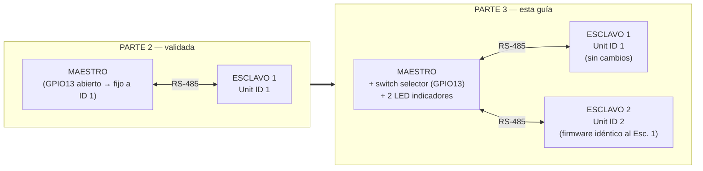

# PARTE 3 — Arquitectura multiesclavo con selección dinámica

**Tarea Nº1** · Protocolos de Comunicaciones Industriales · UNRaf
**Autores:** Bevilacqua Francisco, Peralta Agustina

Guía de ejecución de banco de la Parte 3: se incorpora un segundo esclavo y el
maestro pasa a decidir, en tiempo real, con cuál de los dos conversa. Continúa a
[PARTE-2.md](PARTE-2.md), que se da por completada y validada.

---

## Índice

1. [Objetivo y criterio de terminado](#1-objetivo-y-criterio-de-terminado)
2. [Qué cambia respecto de la Parte 2](#2-qué-cambia-respecto-de-la-parte-2)
3. [El punto clave: no hace falta escribir código nuevo](#3-el-punto-clave-no-hace-falta-escribir-código-nuevo)
4. [Prerrequisitos — qué conseguir antes de empezar](#4-prerrequisitos--qué-conseguir-antes-de-empezar)
5. [Decisiones de banco propias de la Parte 3](#5-decisiones-de-banco-propias-de-la-parte-3)
6. [Lista de materiales](#6-lista-de-materiales)
7. [Conexiones de hardware](#7-conexiones-de-hardware)
8. [Archivos involucrados](#8-archivos-involucrados)
9. [Paso a paso de resolución](#9-paso-a-paso-de-resolución)
10. [Uso de QModMaster en la Parte 3](#10-uso-de-qmodmaster-en-la-parte-3)
11. [Qué datos registrar y de qué manera](#11-qué-datos-registrar-y-de-qué-manera)
12. [Checklist de validación](#12-checklist-de-validación)
13. [Evidencia a capturar para el informe](#13-evidencia-a-capturar-para-el-informe)
14. [Diagnóstico de fallas](#14-diagnóstico-de-fallas)
15. [Banco de preguntas de defensa](#15-banco-de-preguntas-de-defensa)

---

## 1. Objetivo y criterio de terminado

La consigna pide tres cosas (textual):

| # | Consigna | Cómo se cumple |
|---|---|---|
| 1 | Incorporar un segundo esclavo (Dispositivo 2), **idéntica configuración de hardware y mapeo** que el Dispositivo 1, con **ID Esclavo = 2** | Firmware idéntico al Esclavo 1; el jumper de GPIO13 define el Unit ID |
| 2 | Ampliar el maestro con **1 switch selector** y **2 LEDs indicadores** (manteniendo los periféricos de la Parte 2) | El firmware del maestro ya los implementa desde la Fase 0; en la Parte 2 quedaron sin conectar |
| 3 | El maestro dirige sus peticiones al esclavo seleccionado; el LED correspondiente se enciende; **el esclavo no seleccionado retiene su último estado** | Verificación de comportamiento, sin escribir código nuevo (§3) |

**Definition of Done de la Parte 3** — es el cierre de la parte funcional del TP:

- [ ] Las pruebas del checklist de §12 pasan y están anotadas.
- [ ] Video o secuencia de fotos mostrando la conmutación en vivo (switch selector
      → LED indicador → cambio de destino de las transacciones).
- [ ] Evidencia de que el esclavo no seleccionado **retiene** su último valor
      (no se apaga, no se resetea, no cambia solo).
- [ ] Captura del sniffer mostrando tramas dirigidas a **ambos** Unit ID en la
      misma sesión.
- [ ] Tabla de correspondencia de §11 completa.

## 2. Qué cambia respecto de la Parte 2



| Aspecto | Parte 2 | Parte 3 |
|---|---|---|
| Nodos en el bus | 2 (maestro + 1 esclavo) | **3** (maestro + 2 esclavos) |
| GPIO13 del maestro | Sin conectar (fijo a Esclavo 1) | **Switch selector** (Esclavo 1 ↔ Esclavo 2) |
| GPIO22/23 del maestro | Sin conectar (opcionales) | **2 LEDs indicadores**, ahora informativos |
| Firmware del maestro | Sin cambios | **Sin cambios** (la máquina de estados ya soportaba esto) |
| Firmware de los esclavos | Sin cambios | **Sin cambios**, mismo archivo en ambos |
| Protoboards | 2 | 3 |
| Potenciómetros usados | 2 de 2 disponibles | **3** — hace falta conseguir uno más |

**Lo que NO cambia y por eso no vuelve a ser sospechoso:** el mapa de registros,
los parámetros serie, la adaptación de niveles (con el pull-up ya corregido en
[evidencia/INCONVENIENTES.md §4](evidencia/INCONVENIENTES.md#4-ro-en-alta-impedancia-genera-bytes-espurios--la-causa-raíz-de-los-invalid-response-crc)),
el firmware del maestro y el del esclavo. El Esclavo 2 es una **copia física**
del Esclavo 1, con un único bit distinto: el jumper de GPIO13.

## 3. El punto clave: no hace falta escribir código nuevo

Es la decisión de diseño más importante de todo el proyecto, tomada en la
Fase 0, y ahora es cuando rinde: el maestro **ya nació con la máquina de
estados completa** de la Parte 3.

Repasando `firmware/maestro/main.py` (documentado en detalle en
[diagramas/flujo_maestro.md](diagramas/flujo_maestro.md)):

| Bloque | Función | Qué hace | ¿Nuevo en la Parte 3? |
|---|---|---|---|
| M2 | `_accion_leer_selector()` | Lee GPIO13 y fija `_id_activo` | No — existe desde la Parte 2, solo que el pin estaba abierto |
| M3 | `_accion_indicar_seleccion()` | Enciende el LED del esclavo activo, apaga el otro | No — el firmware ya lo ejecuta cada ciclo, sin LEDs conectados no se ve nada |
| M4-M7 | Lecturas y escrituras | Usan `self._id_activo` como destino de cada transacción | No — nunca tuvieron el Unit ID fijo "quemado", siempre leyeron la variable |

**Conclusión operativa: la Parte 3 es 100 % hardware.** Cargar el mismo
`main.py` que ya tenés funcionando en el maestro, cargar el mismo `main.py`
del esclavo en la placa nueva, y conectar tres cosas: el jumper de la placa
nueva, el switch selector, y los dos LEDs indicadores.

> Esto es consecuencia directa de haber elegido, en la Fase 0, resolver la
> Parte 3 completa antes de tener hardware para probarla — la única forma de
> verificar esa decisión de diseño es, precisamente, llegar hasta acá sin haber
> tocado el archivo.

## 4. Prerrequisitos — qué conseguir antes de empezar

| # | Componente | Ya tenés | Falta | Notas |
|---|---|---|---|---|
| 1 | Protoboard 16×5,5 cm | 2 (Maestro, Esclavo 1) | **1** | Para el Esclavo 2. Documentado como pendiente desde [PARTE-2.md §6.1](PARTE-2.md#61-dos-protoboards-una-por-nodo) |
| 2 | Potenciómetro | 10 kΩ (Esc. 1) + 2,2 kΩ (Maestro) | **1 más** | Ver §5.1 — el valor exacto no es crítico |
| 3 | ESP32 DevKit | 2 en uso | **1 más** | Para el Esclavo 2 |
| 4 | Módulo MAX485 | 2 en uso | **1 más** | Para el Esclavo 2 |
| 5 | Pulsador | 2 en uso | **1 más** | Switch local del Esclavo 2 |
| 6 | LED | 4 en uso (2 por nodo) | **4 más** | 2 del Esclavo 2 + 2 indicadores del maestro |
| 7 | Resistencia 330 Ω | 4 en uso | **4 más** | Limitadoras de esos 4 LEDs |
| 8 | Resistencia 2,2 kΩ / 3,3 kΩ (divisor) | 4 en uso (2 por nodo) | **1 par más** | Divisor RO→RX del Esclavo 2 |
| 9 | Resistencia 680 Ω (pull-up) | 2 en uso | **1 más** | Pull-up de RO del Esclavo 2 — **obligatorio**, ver §5.2 |
| 10 | Switch / llave de 2 posiciones | 0 | **1** | Selector de esclavo — puede ser un jumper simple, igual que el de Unit ID |
| 11 | Cables dupont | — | ~15 más | Para el nodo nuevo |

**No hay ningún ítem de software ni de firmware en esta lista.** Es
deliberado: si algo de esto faltara, la Parte 3 se puede seguir armando por
partes (por ejemplo, conectar primero los LEDs indicadores y el selector con
el Esclavo 2 todavía sin montar, verificando que el maestro alterna
correctamente aunque uno de los destinos no responda).

## 5. Decisiones de banco propias de la Parte 3

### 5.1 El tercer potenciómetro: cualquier valor razonable sirve

Igual que se explicó al pasar de 10 kΩ (Esclavo 1) a 2,2 kΩ (Maestro) en
[PARTE-2.md §4.1](PARTE-2.md#41-potenciómetro-de-22-kω-en-el-maestro--sin-cambios-de-firmware),
**el potenciómetro es un divisor de tensión**: lo que llega al ADC depende de
la *relación* entre sus dos mitades, no de la resistencia total. El valor
elegido no requiere ningún cambio en `config.py` ni en `perifericos.py`.

| Valor disponible | ¿Sirve para el Esclavo 2? | Nota |
|---|---|---|
| Otro de 10 kΩ (igual al Esclavo 1) | Sí | Más prolijo para el informe: "hardware idéntico" queda literal |
| Otro de 2,2 kΩ (igual al Maestro) | Sí | Mejor impedancia de fuente para el ADC (ver PARTE-2 §4.1) |
| Cualquier valor entre 1 kΩ y 100 kΩ | Sí | Fuera de ese rango: por debajo, consumo excesivo; por encima, impedancia de fuente demasiado alta para el ADC del ESP32 |

**Recomendación:** conseguir uno de valor similar al del Esclavo 1 (1 kΩ a
10 kΩ), para que la afirmación de "hardware idéntico" que pide la consigna sea
también válida en el detalle de los componentes, no solo en el mapeo de
registros.

### 5.2 El pull-up de 680 Ω va también en el Esclavo 2 — no es opcional

Este es el error más caro que se puede repetir en este proyecto. Documentado
en detalle en
[evidencia/INCONVENIENTES.md §4](evidencia/INCONVENIENTES.md#4-ro-en-alta-impedancia-genera-bytes-espurios--la-causa-raíz-de-los-invalid-response-crc):
sin el pull-up desde RO a 5 V, cada vez que un nodo transmite su propio RO
queda en alta impedancia, el divisor tira el GPIO de recepción a masa, y se
generan bytes `0x00` espurios que corrompen la siguiente trama que llegue
dentro de los 4 ms de silencio permitido.

El Esclavo 2 es una placa **nueva**, armada desde cero: el pull-up no se
"hereda" del Esclavo 1 por estar documentado, hay que soldarlo/conectarlo
físicamente en esta placa también. Ver §7.2 para el detalle de conexión.

### 5.3 Terminación y polarización: se sigue el mismo criterio empírico de la Parte 2

`docs/arquitectura.md` §5 da una tabla general que sugiere terminar el bus a
partir de 3-4 nodos. Sin embargo, la Parte 2 ya demostró en banco que ese
criterio genérico —pensado para una distancia de referencia de 1 a 2 metros—
no aplica igual a este montaje concreto: con el bus real de ~15-20 cm entre
dos protoboards, **750 ciclos sin un solo fallo, sin terminación ni
polarización**.

Al sumar el tercer nodo, el criterio no cambia, **se vuelve a medir**:

```
Longitud crítica (tR = 15 ns del MAX485):  L_c = tR × v / 2 ≈ 1,5 m
Bus de 3 protoboards en línea, con dos saltos de ~15-20 cm cada uno:  ≈ 30-40 cm
```

| Longitud total A-B medida | Decisión |
|---|---|
| **< 1 m** (caso esperado con 3 protoboards de 16 cm) | Sin terminación ni polarización — igual que la Parte 2 |
| ≥ 1,5 m | Instalar 120 Ω en los dos extremos físicos **junto con** la polarización de 680 Ω/680 Ω (§6 de `arquitectura.md`) |

**Criterio de aceptación, igual que en la Parte 2:** si tras varios minutos de
sondeo alternando entre los dos esclavos la línea `[MAESTRO]` sigue mostrando
`fallos=0 (0.0%)`, el bus no necesita terminación. Medir la longitud real y
anotarla — es el dato que respalda la decisión en el informe.

### 5.4 El switch selector: un jumper, NO el pulsador de 4 patas

La consigna pide "1 switch selector de esclavo". No exige que sea un
interruptor de palanca: un jumper simple en GPIO13 del maestro cumple la misma
función y es coherente con el criterio ya usado para fijar el Unit ID de cada
esclavo (§7.4).

| Estado de GPIO13 (maestro) | Lectura | Esclavo direccionado |
|---|---|---|
| **Sin conectar (abierto)** | 1 | Esclavo 1 |
| Puenteado a GND | 0 | Esclavo 2 |

Si se dispone de una llave de dos posiciones física que **queda enclavada**
(una llave deslizante o de palanca de dos estados estables), se puede montar en
su lugar sin ningún cambio de firmware: lo único que importa es que una
posición deje el pin abierto y la otra lo lleve a GND.

> ⚠️ **El pulsador de 4 patas usado como switch local (§7.1 de la Parte 1,
> `EntradaDigital` sobre GPIO18) NO sirve acá, aunque el circuito sea
> idéntico.** Es un pulsador **momentáneo**: solo cierra mientras se lo
> mantiene presionado, y vuelve solo a su posición de reposo (Esclavo 1) al
> soltarlo. Usarlo como selector obligaría a sostenerlo con el dedo durante
> todo el tiempo que se quiera interactuar con el Esclavo 2 — impracticable
> para la prueba de retención de estado del Paso 9, que necesita el selector
> fijo en una posición mientras se opera con las dos manos el switch y el
> potenciómetro locales.
>
> Si el kit de práctica solo trae pulsadores de 4 patas (sin ninguna llave
> deslizante ni DIP switch disponible), la opción correcta y de costo cero es
> el **jumper**: al insertarlo o quitarlo queda en esa posición sin que nadie
> lo sostenga, que es justamente lo que un selector necesita. No es un
> reemplazo de emergencia — es, para este propósito, la opción más adecuada
> de las dos.

## 6. Lista de materiales

Todo lo de la Parte 2 (que sigue en uso, sin cambios), más lo del Esclavo 2 y
los periféricos nuevos del maestro:

| Componente | Cantidad | Valor | Función |
|---|---|---|---|
| ESP32 DevKit | 1 | — | Nodo Esclavo 2 |
| Módulo MAX485 | 1 | — | Transceptor del Esclavo 2 |
| Potenciómetro | 1 | 1-10 kΩ (ver §5.1) | Entrada analógica del Esclavo 2 → IR 30001 |
| Pulsador | 1 | — | Entrada digital del Esclavo 2 → DI 10001 |
| LED | 2 | — | Coil 00001 y HR 40001 del Esclavo 2 |
| LED | 2 | — | Indicadores de selección en el maestro (GPIO22/23) |
| Resistencia | 4 | 330 Ω | Limitadoras de los 4 LEDs nuevos |
| Resistencia | 1 | 2,2 kΩ | R1 del divisor RO→RX del Esclavo 2 |
| Resistencia | 1 | 3,3 kΩ | R2 del divisor RO→RX del Esclavo 2 |
| Resistencia | 1 | **680 Ω** | **Pull-up de RO del Esclavo 2 — obligatorio, ver §5.2** |
| Jumper o llave de 2 posiciones | 1 | — | Selector de esclavo en GPIO13 del maestro |
| Protoboard 16×5,5 cm | 1 | — | Nodo Esclavo 2 |
| Cables dupont | ~15 | — | Interconexión del nodo nuevo |

## 7. Conexiones de hardware

> ⚠️ **Armar el Esclavo 2 con la alimentación desconectada.** Verificar
> continuidad antes de energizar, igual que en las Partes 1 y 2.

### 7.1 Interfaz ESP32 ↔ MAX485 (Esclavo 2) — idéntica a los otros dos nodos

**Figura 1 — ESP32 (Esclavo 2) → MAX485**

```
        ESP32                                    MAX485
  ┌───────────────┐                        ┌──────────────┐
  │               │                        │              │
  │  GPIO17 (TX)  ├───────────────────────►│ DI    (4)    │
  │               │        directo         │              │
  │               │                        │              │
  │  GPIO4        ├────────────┬──────────►│ DE    (3)    │        A (6) ──► al bus
  │               │  directo   └──────────►│ RE    (2)    │        B (7) ──► al bus
  │               │                        │              │
  │  GPIO16 (RX)  │◄────┬──────────────────┤ RO    (1)    │
  │               │     │      2,2 kΩ      │              │
  │               │  3,3 kΩ                │              │
  │               │     │                  │              │
  │      GND      ├─────┴──────────────────┤ GND   (5)    │
  │               │                        │              │
  │      VIN      ├───────────────────────►│ VCC   (8)    │
  └───────────────┘                        └──────────────┘
```

Mismo circuito, mismos valores, misma justificación que en
[PARTE-1.md §5.2](PARTE-1.md#52-interfaz-esp32--max485) y
[PARTE-2.md §6.3](PARTE-2.md#63-interfaz-esp32--max485).

### 7.2 Pull-up de RO (Esclavo 2) — obligatorio

**Figura 2 — Divisor con pull-up (idéntico en los tres nodos)**

```
                     5 V
                      │
                   [ 680 Ω ]      ← pull-up, OBLIGATORIO (ver §5.2)
                      │
   MAX485 RO ─────────┴──[2,2 kΩ]──┬──[3,3 kΩ]── GND
                                   │
                                GPIO16
```

**Verificación antes de dar por bueno el montaje** (igual que en los otros dos
nodos): forzar RO en alto (bus en reposo) y medir el nodo del divisor. Debe
dar entre 2,6 y 3,4 V. Si da ~5 V, el pull-up no está haciendo su trabajo o
el divisor está mal armado.

### 7.3 Bus completo — tres nodos

**Figura 3 — MAX485 (Maestro) ↔ MAX485 (Esclavo 1) ↔ MAX485 (Esclavo 2)**

```
   [MAESTRO]                    [ESCLAVO 1]                   [ESCLAVO 2]
   MAX485                       MAX485                        MAX485
       │                            │                              │
       │ A ──────┐  (trenzado) ┌────┤ A                            │
       │          ├────────────┤    │              A ──────┐  (trenzado) ┌────┤ A
       │ B ──────┘             └────┤ B                     │          ├────────────┤    │
       │                            │              B ──────┘             └────┤ B
       │                            │                              │
       │ GND ─────────────────── GND ─────────────────────────── GND         │
       │                            │                              │
       └── stub < 30 cm ──┘   └── stub < 30 cm ──┘        └── stub < 30 cm ──┘
```

Simplificado, sin las derivaciones repetidas, así queda como referencia
rápida de conexión:

```
   MAX485(M) A ──┬── MAX485(E1) A ──┬── MAX485(E2) A
                 │                  │
   MAX485(M) B ──┼── MAX485(E1) B ──┼── MAX485(E2) B
                 │                  │
        GND ─────┴────── GND ───────┴────── GND
```

**Tres reglas, sin excepción:**

1. **A con A, B con B, en toda la cadena.** El orden en que se van conectando
   los tres nodos no importa (bus lineal, no importa la posición relativa),
   pero la polaridad debe respetarse en cada tramo.
2. **GND común a los tres nodos.** Es la causa número uno de fallas
   intermitentes al agregar el tercer nodo — documentada explícitamente en
   `docs/arquitectura.md` §7.3: "anda entre dos nodos y se cae al agregar el
   tercero".
3. **Topología lineal, nunca en estrella.** El Esclavo 1 se conecta al
   Maestro, y el Esclavo 2 se conecta *a la misma línea*, no en un punto
   aparte formando una Y. Si las protoboards están una al lado de la otra en
   línea, esto sale naturalmente.

### 7.4 Jumper de Unit ID — Esclavo 2

**Figura 4 — Jumper de Unit ID (Esclavo 2, GPIO13 a GND)**

```
   ESP32 (Esclavo 2)

   GPIO13 ────────┬──── GND
                  │
             (jumper puesto)

   Lectura del pin: 0  →  Unit ID = 2
```

Es el único punto de hardware que distingue al Esclavo 2 del Esclavo 1: en el
Esclavo 1, GPIO13 queda **sin conectar** (abierto → Unit ID = 1); en el
Esclavo 2, se **puentea a GND** (Unit ID = 2). El resto del cableado y el
firmware son idénticos.

> ⚠️ **Verificar esto dos veces antes de energizar los dos esclavos juntos.**
> Si por error el Esclavo 2 queda con el jumper abierto (o directamente sin
> jumper), ambos esclavos responderán con Unit ID = 1: sus tramas
> colisionarán en el bus y el maestro recibirá basura con CRC siempre
> inválido — un síntoma indistinguible, a primera vista, de un problema de
> cableado del bus.

### 7.5 Selector de esclavo — Maestro

**Figura 5 — Selector de esclavo (Maestro, GPIO13)**

```
   ESP32 (Maestro)

   GPIO13 ────────┬──── jumper puesto/quitado ──── GND
                  │
           (pull-up interno,
            activado por software)

   Jumper QUITADO (abierto)  →  pin en 1  →  Esclavo 1 activo
   Jumper PUESTO (a GND)     →  pin en 0  →  Esclavo 2 activo
```

⚠️ **No usar acá el pulsador de 4 patas del switch local — ver §5.4.** Es un
componente momentáneo (vuelve solo a su reposo al soltarlo) y obligaría a
sostenerlo presionado todo el tiempo que se quiera hablar con el Esclavo 2.
El jumper, en cambio, queda en la posición elegida sin que nadie lo sostenga,
que es lo que un selector necesita.

Mismo circuito que el jumper de Unit ID de los esclavos (§7.4), pero con un
significado distinto según el rol del nodo — documentado explícitamente en
`config.py`:

```python
#: En un ESCLAVO: jumper que fija la direccion fisica.
#: En el MAESTRO: switch selector del esclavo destino.
PIN_SELECTOR = 13
```

No hace falta resistencia externa: el pull-up interno del ESP32 (~45 kΩ) ya
lo resuelve, igual que en todos los pulsadores del proyecto.

### 7.6 LEDs indicadores de selección — Maestro

**Figura 6 — LEDs indicadores (Maestro, GPIO22/23)**

```
   ESP32 GPIO22 ────►│──── [ 330 Ω ] ──── GND      Indicador "Esclavo 1 activo"
                    LED

   ESP32 GPIO23 ────►│──── [ 330 Ω ] ──── GND      Indicador "Esclavo 2 activo"
                    LED
```

Estos dos LEDs ya estaban contemplados como conexión opcional en
[PARTE-2.md §6.8](PARTE-2.md#68-leds-indicadores-de-selección-opcionales-en-esta-parte).
Si ya se montaron durante la Parte 2, no hay nada que hacer acá salvo
verificarlos; si no, es el momento de conectarlos.

**Por qué son mutuamente excluyentes por diseño, no por casualidad:** los dos
LEDs se calculan en `_accion_indicar_seleccion()` a partir de la misma
variable (`_id_activo`), de modo que es imposible que queden ambos encendidos
o ambos apagados:

```python
es_esclavo_1 = self._id_activo == config.ID_ESCLAVO_1
self._perifericos["indicador_1"].escribir(es_esclavo_1)
self._perifericos["indicador_2"].escribir(not es_esclavo_1)
```

### 7.7 Tabla completa de conexiones nuevas de esta parte

| # | Desde | Hacia | Nodo | Nota |
|---|---|---|---|---|
| 1 | ESP32 GPIO17 (Esc. 2) | MAX485 DI | Esclavo 2 | Directo |
| 2 | MAX485 RO (Esc. 2) | ESP32 GPIO16 (Esc. 2) | Esclavo 2 | Vía divisor + pull-up (§7.2) |
| 3 | ESP32 GPIO4 (Esc. 2) | MAX485 DE + RE | Esclavo 2 | Directo, unidos |
| 4 | ESP32 GPIO18 (Esc. 2) | Pulsador → GND | Esclavo 2 | Pull-up interno |
| 5 | ESP32 3V3 (Esc. 2) | Potenciómetro extremo 1 | Esclavo 2 | — |
| 6 | ESP32 GND (Esc. 2) | Potenciómetro extremo 2 | Esclavo 2 | — |
| 7 | Potenciómetro cursor | ESP32 GPIO34 (Esc. 2) | Esclavo 2 | — |
| 8 | ESP32 GPIO19 (Esc. 2) | LED 1, ánodo | Esclavo 2 | 330 Ω a GND |
| 9 | ESP32 GPIO21 (Esc. 2) | LED 2, ánodo | Esclavo 2 | 330 Ω a GND |
| 10 | ESP32 GPIO13 (Esc. 2) | GND | Esclavo 2 | **Jumper puesto → Unit ID 2** |
| 11 | MAX485 A (Esc. 2) | Línea A del bus (continuación desde Esc. 1) | Bus | Trenzado con B |
| 12 | MAX485 B (Esc. 2) | Línea B del bus | Bus | Trenzado con A |
| 13 | GND (Esc. 2) | GND del bus (común a los 3 nodos) | Bus | ⚠️ Imprescindible |
| 14 | ESP32 GPIO13 (Maestro) | Selector → GND | Maestro | Abierto = Esc. 1, a GND = Esc. 2 |
| 15 | ESP32 GPIO22 (Maestro) | LED indicador 1, ánodo | Maestro | 330 Ω a GND |
| 16 | ESP32 GPIO23 (Maestro) | LED indicador 2, ánodo | Maestro | 330 Ω a GND |

Las filas 1-9 son idénticas, componente por componente, a las del Esclavo 1
([PARTE-1.md §5.1](PARTE-1.md#51-tabla-completa-de-conexiones)).

## 8. Archivos involucrados

### 8.1 Se cargan en el Esclavo 2 (a la raíz `/`) — sin ningún cambio

| Archivo de origen | Nombre en el ESP32 | Nota |
|---|---|---|
| [firmware/comun/config.py](firmware/comun/config.py) | `config.py` | **Copia exacta** de la que ya usan el maestro y el Esclavo 1 |
| [firmware/comun/perifericos.py](firmware/comun/perifericos.py) | `perifericos.py` | **Copia exacta** |
| [firmware/esclavo/main.py](firmware/esclavo/main.py) | `main.py` | **El mismo archivo que corre en el Esclavo 1**, sin modificar |
| librería `umodbus` | `lib/umodbus/` | Instalar con el gestor de paquetes de Thonny, como en las dos placas anteriores |

**No hay un `esclavo2/main.py` en el repositorio, y no hace falta crear uno.**
El diseño del proyecto (jumper de GPIO13 leído al arrancar) existe
específicamente para que un solo archivo sirva para los dos esclavos.

### 8.2 El maestro no se toca

`firmware/maestro/main.py` sigue siendo exactamente el mismo que en la Parte
2. No hay que recargarlo ni modificarlo — solo conectar el hardware nuevo
(§7.5 y §7.6).

### 8.3 Herramientas en la PC — sin cambios respecto de la Parte 2

| Archivo | Para qué en esta parte |
|---|---|
| [herramientas/sniffer_rs485.py](herramientas/sniffer_rs485.py) | Ahora va a mostrar tramas dirigidas a **dos** Unit ID distintos en la misma captura — ver §10 y §13 |
| [herramientas/modbus_tramas.py](herramientas/modbus_tramas.py) | Decodificar tramas sueltas capturadas, igual que en las partes anteriores |

### 8.4 Trazabilidad código ↔ diagrama de flujo

Requerimiento adicional 2 de la consigna. Los bloques M2 y M3 —ya
documentados en [diagramas/flujo_maestro.md](diagramas/flujo_maestro.md)—
son los que se ejercitan por primera vez con hardware real en esta parte:

| Bloque | Función en `maestro/main.py` | Qué se verifica ahora que no se podía en la Parte 2 |
|---|---|---|
| M2 | `_accion_leer_selector()` | Que el pin realmente cambia el destino de las 4 transacciones del ciclo |
| M3 | `_accion_indicar_seleccion()` | Que el LED correspondiente enciende, y el otro se apaga, en cada cambio |

## 9. Paso a paso de resolución

Cada paso tiene criterio de aceptación. El orden aísla el riesgo: primero se
valida el Esclavo 2 **solo**, sin el Esclavo 1 en el bus, para no mezclar dos
posibles fuentes de falla.

### Paso 0 — Confirmar que la Parte 2 sigue en pie

Con el maestro y el Esclavo 1 conectados como quedaron al final de la Parte 2:

- El Shell del maestro muestra líneas `[MAESTRO] ciclos=... fallos=0 (0.0%)`.
- Los cuatro caminos de datos (switch↔LED, potenciómetro↔PWM, en ambos
  sentidos) responden.

> ✅ **Criterio:** igual que al cierre de la Parte 2. Si no, resolver ahí
> primero — ver [PARTE-2.md §14](PARTE-2.md#14-diagnóstico-de-fallas).

### Paso 1 — Montar el hardware del Esclavo 2, aislado del bus

Armar la protoboard #3 con §7.1, §7.2 y §7.4, **sin conectar A/B al bus
todavía**. Con multímetro, en modo continuidad:

- No hay continuidad entre VIN/3V3 y GND.
- No hay continuidad entre A y B.

> ✅ **Criterio:** ningún cortocircuito.

### Paso 2 — Verificar el pull-up del Esclavo 2 ⚠️ paso crítico

Igual que en los otros dos nodos: alimentar, forzar RO en alto (bus en
reposo, sin nada conectado a A/B todavía es equivalente), medir el nodo del
divisor.

> ✅ **Criterio:** entre 2,6 y 3,4 V. Si da ~5 V, revisar el pull-up antes de
> continuar.

### Paso 3 — Verificar los periféricos locales del Esclavo 2

Cargar `config.py` y `perifericos.py`, correr
[firmware/prueba_perifericos.py](firmware/prueba_perifericos.py) con F5.

> ✅ **Criterio:** las 5 pruebas en verde (con las confirmaciones `s`/`n` de
> los LEDs, corregidas en
> [evidencia/INCONVENIENTES.md §1](evidencia/INCONVENIENTES.md#1-prueba-de-led-sin-verificación-real)).
> En la prueba del selector, verificar que **ambas** posiciones se detectan
> (esta vez el jumper de Unit ID va efectivamente a GND en una de ellas).

### Paso 4 — Cargar el firmware y confirmar el Unit ID

Cargar `firmware/esclavo/main.py` como `main.py`, reiniciar con Ctrl+F2.

```
==========================================================
ESCLAVO MODBus RTU  |  Unit ID = 2
Bus: 9600 baudios, 8N1
UART2  TX=GPIO17  RX=GPIO16  DE/RE=GPIO4
Registros: DI 10001 | IR 30001 | Coil 00001 | HR 40001
==========================================================
```

> ✅ **Criterio:** dice **Unit ID = 2**. Si dijera 1, el jumper de GPIO13 no
> está haciendo contacto con GND.

### Paso 5 — Validar el Esclavo 2 en solitario desde QModMaster

Con el maestro **apagado o desconectado del bus** (para no tener dos
iniciadores a la vez, regla de
[PARTE-2.md §3](PARTE-2.md#3-la-regla-que-domina-toda-la-parte-2-un-solo-maestro)),
conectar el conversor USB-RS485 directamente al Esclavo 2 y repetir el
checklist básico de la Parte 1, con **Slave Addr = 2**:

- Leer DI 10001, IR 30001.
- Escribir Coil 00001 y HR 40001.

> ✅ **Criterio:** el Esclavo 2 responde igual que el Esclavo 1 lo hizo en la
> Parte 1, con Unit ID 2. Esto aísla cualquier problema del Esclavo 2 antes
> de sumarlo al bus con los otros dos nodos.

### Paso 6 — Sumar el Esclavo 2 al bus físico

Conectar A, B y GND del Esclavo 2 a la misma línea que ya comparten el
maestro y el Esclavo 1 (§7.3). El Esclavo 2 sigue con su propio firmware
corriendo; el maestro todavía apuntando solo al Esclavo 1 (GPIO13 abierto).

> ✅ **Criterio:** el maestro sigue mostrando `fallos=0` con el Esclavo 1,
> sin verse afectado por la presencia del Esclavo 2 en el bus (que
> simplemente descarta en silencio las tramas que no le corresponden).

### Paso 7 — Conectar el selector y los LEDs indicadores en el maestro

Cablear §7.5 y §7.6. No hace falta recargar ningún firmware.

> ✅ **Criterio:** con el selector abierto, el LED indicador 1 está
> encendido y el 2 apagado. Al puentear el selector a GND, se invierten en
> el siguiente ciclo (máximo 200 ms de retardo).

### Paso 8 — Verificar la conmutación completa

Con el sistema completo armado, alternar el selector varias veces y observar:

| Acción | Resultado esperado |
|---|---|
| Selector abierto | LED indicador 1 encendido; el switch y potenciómetro del maestro controlan al Esclavo 1; los LEDs replicadores del maestro reflejan al Esclavo 1 |
| Selector a GND | LED indicador 2 encendido; el switch y potenciómetro del maestro controlan al Esclavo 2; los LEDs replicadores del maestro reflejan al Esclavo 2 |

> ✅ **Criterio:** la conmutación es visible e inmediata (dentro de un
> período de sondeo, 200 ms). Grabar esto en video — ver §13.

### Paso 9 — Verificar la retención de estado (el punto central de la consigna)

Este es el requisito más específico de la Parte 3 y el que más vale la pena
demostrar con evidencia clara:

```
1. Selector en Esclavo 1. Girar el potenciómetro del maestro a fondo
   (PWM = 255). Verificar que el LED PWM del Esclavo 1 está al máximo.
2. Cambiar el selector a Esclavo 2. Girar el potenciómetro del maestro
   a la mitad (PWM ≈ 128). Verificar que el LED PWM del Esclavo 2 sigue
   ese cambio.
3. Sin tocar más el potenciómetro del maestro, volver el selector a
   Esclavo 1 y ESPERAR sin accionar nada.
4. Observar el LED PWM del Esclavo 1: debe seguir al máximo (255),
   exactamente como quedó en el paso 1, aunque hayan pasado varios
   ciclos de sondeo dirigidos al Esclavo 2 mientras tanto.
```

> ✅ **Criterio:** el Esclavo 1 **no cambia solo, no se apaga y no se
> resetea** mientras el maestro habla con el Esclavo 2. Es la prueba 14 del
> checklist de §12, y merece foto o video propio para el informe.

## 10. Uso de QModMaster en la Parte 3

### 10.1 Verificación cruzada con ambos esclavos

La misma restricción de "un solo maestro" de la Parte 2 sigue aplicando: no
usar QModMaster mientras el maestro ESP32 está sondeando. Los usos válidos
son antes de encender el maestro o con él detenido (Ctrl+C):

```
1. Detener el maestro (Ctrl+C en su Shell de Thonny)
2. QModMaster → Connect
3. Slave Addr = 1 → Read Holding Registers (0x03), addr 0
   → debe devolver el último valor que el maestro escribió en el Esclavo 1
4. Slave Addr = 2 → Read Holding Registers (0x03), addr 0
   → debe devolver el último valor que el maestro escribió en el Esclavo 2
5. QModMaster → Disconnect
6. Reanudar el maestro (Ctrl+F2)
```

**Qué demuestra este procedimiento:** que los dos esclavos retienen valores
**independientes** entre sí, cada uno con el último que efectivamente recibió
— es la verificación externa e inequívoca del requisito de retención,
adicional a la observación visual del Paso 9.

### 10.2 Confirmar que un Unit ID equivocado da timeout, no una respuesta cruzada

Prueba de robustez, rápida y valiosa para el informe: con **Slave Addr = 3**
(un Unit ID que no existe en el bus), cualquier lectura debe dar **timeout**,
nunca una respuesta de alguno de los dos esclavos reales. Confirma que el
filtrado por Unit ID de cada esclavo funciona incluso con dos nodos activos
compitiendo por la misma dirección física del bus.

## 11. Qué datos registrar y de qué manera

### 11.1 Tabla A — Conmutación del selector

| Posición del selector | LED indicador 1 | LED indicador 2 | Esclavo direccionado | Tiempo de conmutación observado |
|---|---|---|---|---|
| Abierto | | | | |
| A GND | | | | |

### 11.2 Tabla B — Retención de estado (Paso 9)

| Paso | Selector | Acción | Valor esperado en Esclavo 1 | Valor esperado en Esclavo 2 | Valor observado |
|---|---|---|---|---|---|
| 1 | Esclavo 1 | PWM maestro a fondo | 255 | (sin cambios) | |
| 2 | Esclavo 2 | PWM maestro a la mitad | **255 (retenido)** | 128 | |
| 3 | Esclavo 1 (vuelta) | Ninguna | **255 (retenido)** | 128 | |

### 11.3 Tabla C — Métricas por esclavo, tomadas de la instrumentación del maestro

Extender la tabla de [PARTE-2.md §11.3, "Tabla C — Métricas temporales y de error"](PARTE-2.md)
para cada esclavo por separado, alternando el selector durante la medición:

| Métrica | Con Esclavo 1 seleccionado | Con Esclavo 2 seleccionado |
|---|---|---|
| t_ciclo | | |
| Tasa de error | | |
| ID reportado en el log | 1 | 2 |

Deberían coincidir entre sí (mismo hardware, mismo firmware, mismo bus): una
diferencia notable entre ambos apuntaría a un problema específico de una de
las dos placas (por ejemplo, el pull-up del Esclavo 2 mal armado).

### 11.4 Tabla D — Tramas capturadas por Unit ID

Con el sniffer corriendo mientras se alterna el selector varias veces:

| Unit ID en la trama | Tramas capturadas | Con CRC inválido |
|---|---|---|
| 1 | | |
| 2 | | |
| Otro / ninguno | 0 (esperado) | — |

## 12. Checklist de validación

| # | Prueba | Resultado esperado | Valor obtenido | ✔ |
|---|---|---|---|---|
| 1 | Pull-up del Esclavo 2 medido | 2,6 a 3,4 V | | ⬜ |
| 2 | `prueba_perifericos.py` en el Esclavo 2 | 5 pruebas OK | | ⬜ |
| 3 | Cabecera de arranque del Esclavo 2 | Dice `Unit ID = 2` | | ⬜ |
| 4 | Esclavo 2 validado en solitario desde QModMaster | Lectura/escritura OK con Slave Addr 2 | | ⬜ |
| 5 | Esclavo 2 sumado al bus, maestro sigue con Esclavo 1 | `fallos=0` sin cambios | | ⬜ |
| 6 | Selector abierto | LED indicador 1 encendido, 2 apagado | | ⬜ |
| 7 | Selector a GND | LED indicador 2 encendido, 1 apagado | | ⬜ |
| 8 | Selector en Esclavo 1: switch/pote del maestro controla Esclavo 1 | Los 4 caminos responden con el Esclavo 1 | | ⬜ |
| 9 | Selector en Esclavo 2: switch/pote del maestro controla Esclavo 2 | Los 4 caminos responden con el Esclavo 2 | | ⬜ |
| 10 | **Retención de estado** (Paso 9 completo) | El esclavo no seleccionado no cambia | | ⬜ |
| 11 | QModMaster lee Esclavo 1 y Esclavo 2 con el maestro detenido | Valores independientes y correctos | | ⬜ |
| 12 | Slave Addr = 3 (inexistente) | Timeout, nunca una respuesta cruzada | | ⬜ |
| 13 | Conmutación rápida del selector, varias veces seguidas | Sin colgarse, sin fallos acumulados | | ⬜ |
| 14 | Sondeo continuo 5 minutos, alternando el selector cada minuto | Tasa de error 0,0 % en ambos esclavos | | ⬜ |
| 15 | Captura del sniffer con tramas a ambos Unit ID | Presentes y con CRC válido | | ⬜ |

> Las pruebas **10, 11 y 12 son las que definen si se cumple el requisito
> central de la consigna.** Un sistema que conmuta visualmente bien pero no
> retiene estado, o que responde con el esclavo equivocado ante una
> dirección inexistente, no cumple con "arquitectura multiesclavo con
> selección dinámica" — cumple solo la parte visual.

## 13. Evidencia a capturar para el informe

| # | Qué capturar | Formato | Sección del informe |
|---|---|---|---|
| 1 | Foto del banco completo con los tres nodos | JPG | Arquitectura |
| 2 | Multímetro midiendo el pull-up del Esclavo 2 | JPG | Verificación del diseño |
| 3 | Shell del Esclavo 2 con la cabecera (`Unit ID = 2`) | PNG | Implementación |
| 4 | **Video: conmutar el selector y mostrar los LEDs indicadores cambiando** | MP4 | Demostración funcional |
| 5 | **Video: los 4 caminos de datos respondiendo primero con Esclavo 1, después con Esclavo 2** | MP4 | Demostración funcional |
| 6 | **Video o secuencia de fotos del Paso 9 (retención de estado)** | MP4 / JPG × 3 | **Resultados — retención de estado** |
| 7 | QModMaster leyendo ambos esclavos con el maestro detenido | PNG | Verificación cruzada |
| 8 | Captura del sniffer con tramas a Unit ID 1 y 2 en la misma sesión | TXT | Análisis de tramas |
| 9 | Shell del maestro tras 5 minutos alternando el selector | PNG | Resultados |
| 10 | Tablas A a D de §11 completas | — | Resultados |

> **El punto 6 es la evidencia más importante de toda la Tarea Nº1.** Es la
> demostración directa de que el diseño de datos de MODBus (registros que
> conservan su valor hasta la próxima escritura) resuelve, sin código
> adicional, el requisito más específico de la consigna. Vale la pena
> dedicarle tiempo a que la captura sea clara: mostrar el valor antes de
> cambiar de esclavo, el cambio de selector, y el valor después, sin cortes.

## 14. Diagnóstico de fallas

### 14.1 Ambos esclavos responden a la vez / CRC siempre inválido al conectar el Esclavo 2

| Causa | Verificación |
|---|---|
| **El jumper del Esclavo 2 no está puesto** (o no hace contacto) | Revisar la cabecera de arranque: debe decir `Unit ID = 2`. Si dice 1, ahí está |
| El jumper está en el pin equivocado | Confirmar que es GPIO13 y no un pin vecino |

### 14.2 El Esclavo 2 nunca responde, ni siquiera en solitario (Paso 5)

Aplican exactamente los mismos diagnósticos que en
[PARTE-1.md §12](PARTE-1.md#12-diagnóstico-de-fallas) (A/B invertidas, falta
de GND común, parámetros serie, `umodbus` no instalado) — el Esclavo 2 es una
placa nueva y puede tener cualquiera de esos problemas de puesta en marcha
por primera vez, igual que tuvo el Esclavo 1 en la Parte 1.

### 14.3 Al sumar el Esclavo 2 al bus, el Esclavo 1 empieza a fallar

| Causa | Verificación |
|---|---|
| Los dos esclavos comparten Unit ID (ver §14.1) | Cabecera de arranque de cada uno |
| El Esclavo 2 no tiene el pull-up de RO (§5.2, §7.2) | Sus propios bytes `0x00` (ver [evidencia/INCONVENIENTES.md §4](evidencia/INCONVENIENTES.md#4-ro-en-alta-impedancia-genera-bytes-espurios--la-causa-raíz-de-los-invalid-response-crc)) se inyectan en el bus y corrompen tramas de cualquier transacción que llegue justo después, sin importar a quién iban dirigidas |
| Bus más largo de lo estimado, ahora con reflexiones | Medir la longitud total y aplicar el criterio de §5.3 |

### 14.4 El selector no conmuta nada (los LEDs indicadores no cambian)

| Causa | Verificación |
|---|---|
| El selector no está en GPIO13 del **maestro** | Confirmar el pin; es fácil confundirlo con el jumper de un esclavo si las placas están cerca |
| Los LEDs indicadores no están conectados | Revisar GPIO22/GPIO23, resistencias de 330 Ω y su retorno a GND |
| Falta reiniciar el maestro tras conectar los LEDs | No hace falta — el firmware ya los gestiona, pero si se cambió algo más, Ctrl+F2 |

### 14.5 Los LEDs indicadores cambian, pero los datos no siguen al esclavo correcto

Esto indicaría un problema en `_id_activo` no propagándose a las
transacciones de lectura/escritura — revisar que no se haya editado
accidentalmente `firmware/maestro/main.py` (no debería haber sido necesario
ningún cambio en esta parte, ver §3). Si el archivo es el original sin
modificar, este síntoma no debería poder ocurrir: es una señal de que el
firmware cargado no es el esperado.

### 14.6 El esclavo no seleccionado SÍ cambia de estado (falla la retención)

Sería una falla grave del requisito central de la consigna. Antes de
sospechar del diseño (que es sólido: la retención es una propiedad del
modelo de datos de MODBus, no requiere código), verificar:

| Causa | Verificación |
|---|---|
| El esclavo "no seleccionado" en realidad está recibiendo tramas | Revisar con el sniffer si hay tramas dirigidas a su Unit ID durante ese período — indicaría que el selector no está realmente desconectando la comunicación |
| Se interpretó mal la prueba: el valor cambió porque se lo escribió antes, no porque cambió solo | Repetir el Paso 9 con más cuidado en el orden de las acciones |

### 14.7 Timeouts esporádicos solo al alternar rápido el selector

| Causa | Explicación |
|---|---|
| El selector se lee una vez por ciclo completo (bloque M2), no entre transacciones | Si se cambia la posición del selector a mitad de un ciclo de 200 ms, ese ciclo ya definió su destino; el cambio se aplica recién en el ciclo siguiente. No es una falla, es el comportamiento documentado en [diagramas/flujo_maestro.md](diagramas/flujo_maestro.md) |

## 15. Banco de preguntas de defensa

| # | Pregunta | Dónde está la respuesta |
|---|---|---|
| 1 | ¿Por qué no hizo falta escribir código nuevo para la Parte 3? | §3 — la máquina de estados se diseñó completa desde la Fase 0 |
| 2 | ¿Cómo se garantiza que el esclavo no seleccionado retiene su estado? | §9 Paso 9 y §11.2 — es una propiedad del modelo de datos MODBus, no del firmware |
| 3 | ¿Qué pasa si los dos esclavos tienen el mismo Unit ID por error? | §14.1 — colisión de tramas, CRC siempre inválido |
| 4 | ¿Por qué el jumper de Unit ID y el selector de esclavo usan el mismo mecanismo de hardware? | §5.4, §7.4, §7.5 — ambos son "un GPIO con pull-up interno, puenteado o no a GND"; el significado lo da el rol del nodo, no el circuito |
| 5 | ¿Cómo distinguirían, mirando una captura del sniffer, si el maestro está hablando con el Esclavo 1 o el 2? | §10.1, §13 punto 8 — por el primer byte de cada trama (Unit ID) |
| 6 | ¿Qué pasa si se consulta un Unit ID que no existe en el bus? | §10.2, §14 checklist ítem 12 — timeout, nunca una respuesta cruzada |
| 7 | ¿Cómo escalarían el sistema a un tercer esclavo? | Agregar un tercer valor de retorno posible en `_accion_leer_selector()` y un tercer par jumper/LED — el resto de la arquitectura no cambia |
| 8 | ¿Por qué el selector se lee una sola vez por ciclo y no antes de cada transacción? | [diagramas/flujo_maestro.md](diagramas/flujo_maestro.md) — para que las 4 transacciones de un mismo ciclo sean atómicas respecto del destino |
| 9 | ¿Qué evidencia tienen de que el pull-up de RO también hacía falta en el segundo esclavo? | [evidencia/INCONVENIENTES.md §4](evidencia/INCONVENIENTES.md#4-ro-en-alta-impedancia-genera-bytes-espurios--la-causa-raíz-de-los-invalid-response-crc) — mismo mecanismo físico, independiente de cuál nodo sea |
| 10 | ¿Qué garantiza que agregar un tercer nodo al bus no iba a romper el que ya funcionaba? | §5.3 — el criterio de terminación se volvió a evaluar con la longitud real, no se asumió |

---

## Qué queda para el cierre del proyecto

Con la Parte 3 validada, las tres partes funcionales de la consigna están
completas. Lo que resta es documental, no de banco:

- **Requerimientos adicionales** (diagrama de flujo, trazabilidad, análisis
  de tramas): ya cubiertos de forma incremental en cada parte — ver
  [README.md §3](README.md#3-dónde-se-responde-cada-requerimiento-de-la-consigna).
- **Preguntas de evaluación teórico-práctica**: respondidas en
  [PARTE-1.md §13](PARTE-1.md#13-pregunta-de-análisis-de-la-parte-1) y en
  `docs/protocolo-comunicacion.md` y `docs/arquitectura.md`.
- **Informe técnico**: se redacta al final, integrando los tres `PARTE-N.md`,
  `evidencia/INCONVENIENTES.md` y las capturas de `evidencia/`.
- **Defensa oral**: los tres bancos de preguntas (uno por parte) son la base
  del guion de 12 minutos.

---

## Referencias

- Modbus Organization. (2012). *MODBUS Application Protocol Specification V1.1b3*. [docs/modbusprotocolspecification.pdf](docs/modbusprotocolspecification.pdf)
- Maxim Integrated. (2003). *MAX481/MAX483/MAX485/MAX487–MAX491/MAX1487 datasheet* (Rev. 8). [docs/MAX481.PDF](docs/MAX481.PDF)
