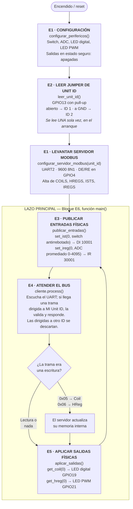
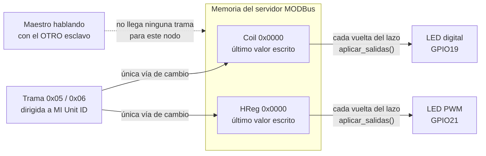
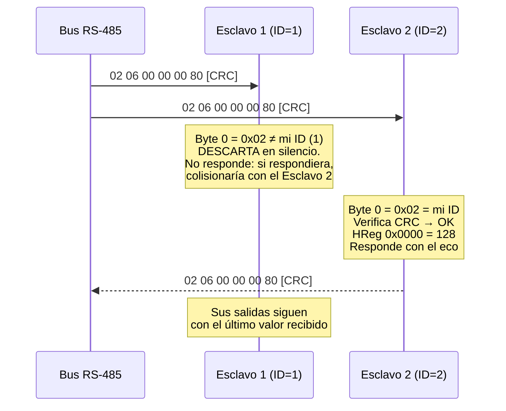

# Diagrama de flujo — Esclavo MODBus RTU

Cada bloque nombra la función de [firmware/esclavo/main.py](../firmware/esclavo/main.py)
que lo implementa (requerimiento adicional 2 de la consigna: trazabilidad de código).

## 1. Flujo del esclavo

## 2. Cómo se cumple la retención de estado (Parte 3)

La consigna exige que "el esclavo que no esté seleccionado mantenga el último
estado recibido en sus salidas hasta recibir una nueva orden". **No hace falta
escribir ninguna lógica de retención**: es una propiedad del modelo de datos de
MODBus, no un añadido del firmware.

Lo que sí depende del firmware es el requisito **complementario**: no
reinicializar esos registros dentro del lazo. Por eso los valores iniciales se
fijan una única vez, en `configurar_servidor_modbus()`, y nunca dentro de `main()`.
Un firmware que pusiera `set_coil(0, False)` en cada vuelta apagaría el LED
constantemente y rompería la retención — es el error típico en esta consigna.

## 3. Qué hace el esclavo cuando la trama no es para él

Todos los nodos del bus reciben **eléctricamente** todas las tramas: RS-485 es un
medio compartido, no conmutado. El filtrado por Unit ID es una decisión de
software del esclavo. Que un solo nodo responda por vez es lo que evita las
colisiones en un bus half-duplex, y por eso el modelo maestro-esclavo por sondeo
no necesita ningún mecanismo de arbitraje: el turno de palabra lo otorga el
maestro al dirigir la petición.

## 4. Por qué el lazo del esclavo no tiene espera

A diferencia del maestro, el lazo del esclavo **no** lleva un `sleep`. El ritmo lo
impone el maestro: `process()` consume el tiempo que haga falta escuchando el
UART y retorna en cuanto atiende una trama o vence su timeout interno.

Agregar una espera reduciría la fracción de tiempo en que el esclavo está
efectivamente escuchando el bus. Si la trama del maestro llega durante ese
`sleep`, los bytes se acumulan en el buffer del UART y el silencio entre ellos ya
no se puede medir: se viola la delimitación por t1,5/t3,5 y la trama se descarta.
El síntoma sería "el esclavo responde a veces sí y a veces no", uno de los más
difíciles de diagnosticar sin analizador lógico.

## 5. Orden de las operaciones dentro del lazo

El orden `publicar entradas → atender bus → aplicar salidas` no es arbitrario:

| Orden | Consecuencia |
|---|---|
| Publicar **antes** de `process()` (elegido) | La respuesta lleva el valor más reciente del switch y del ADC |
| Publicar **después** de `process()` | Cada respuesta llevaría el valor del ciclo anterior: se agregaría un período de sondeo completo (200 ms) de retardo, sin ningún beneficio |
| Aplicar salidas **después** de `process()` (elegido) | Una escritura recibida en este ciclo se refleja en el hardware de inmediato |
| Aplicar salidas **antes** de `process()` | Una orden recibida tardaría una vuelta completa en verse en el LED |
