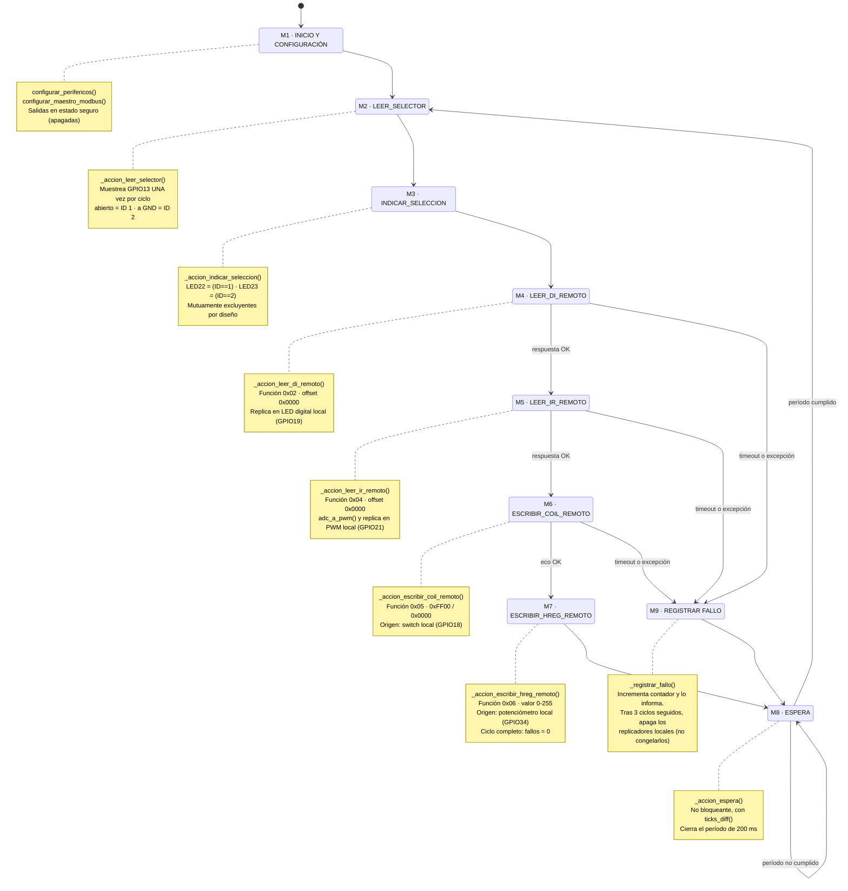
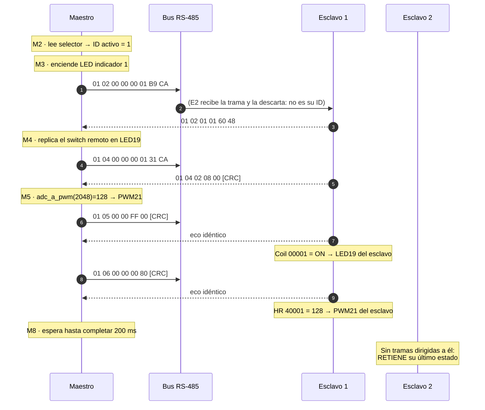
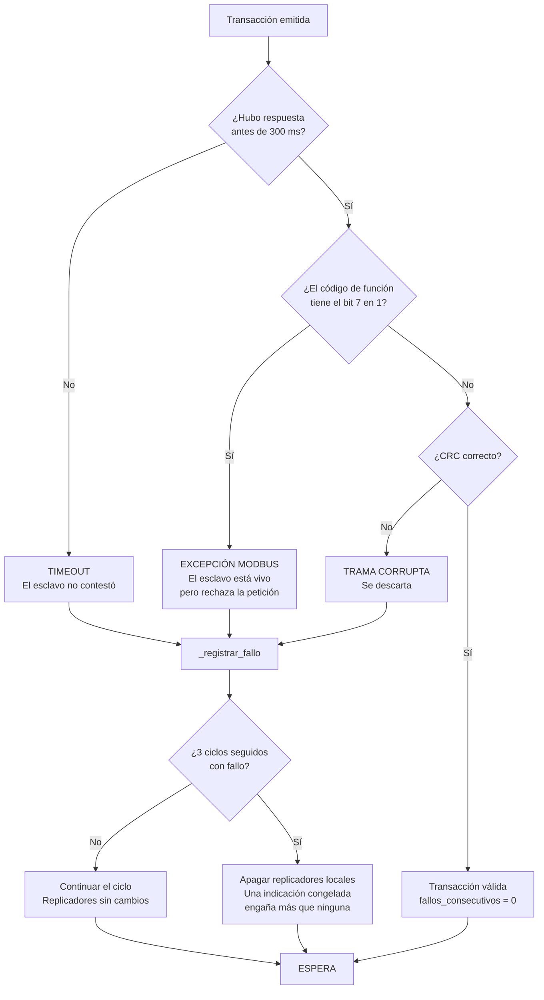

# Diagrama de flujo — Maestro MODBus RTU

**Autores:** Bevilacqua Francisco, Peralta Agustina

Cumple el requerimiento adicional 1 de la consigna ("máquina de estados, ciclo de
polling, conmutación de esclavo") y el requerimiento 2 ("trazabilidad de código":
cada bloque nombra la función de [firmware/maestro/main.py](../firmware/maestro/main.py)
que lo implementa).

## 1. Máquina de estados

## 2. Ciclo de polling en el tiempo

Muestra por qué el período es de 200 ms y no de 100 ms — ver el cálculo completo
en `PERIODO_SONDEO_MS` de [firmware/comun/config.py](../firmware/comun/config.py).

## 3. Por qué una máquina de estados y no una secuencia lineal

| Criterio | Secuencia lineal con `if` | Máquina de estados explícita |
|---|---|---|
| Correspondencia con el diagrama pedido | Difusa, hay que reconstruirla | Uno a uno, verificable |
| Bloqueo ante esclavo caído | El lazo entero queda detenido tras 4 timeouts encadenados | Se aborta el ciclo en el primer fallo y se vuelve a ESPERA |
| Agregar un tercer esclavo o transacción | Toca la lógica existente | Se agrega un estado y una entrada en la tabla de despacho |
| Instrumentación para depurar | Hay que sembrar prints por todo el código | Un único print en `ejecutar_paso()` traza todo el ciclo |

El costo es unas 40 líneas más de código y un nivel más de indirección (la tabla
`_acciones`). Se acepta porque el requerimiento 1 de la consigna pide
explícitamente representar el maestro como máquina de estados, y porque el
comportamiento ante fallo — no bloquearse — es un requisito de un sistema de
control, no un lujo.

## 4. Estados de falla y degradación

**Distinción que conviene tener clara para la defensa:** un timeout y una
excepción MODBus son diagnósticos opuestos. El timeout apunta a la capa física o
al direccionamiento (cable, terminación, Unit ID equivocado, esclavo sin
alimentación). La excepción prueba que el esclavo está vivo, escuchó, verificó el
CRC y decidió rechazar: el problema está en la petición (dirección inexistente,
valor fuera de rango, función no implementada). Confundirlos hace perder horas
revisando el cableado cuando el error está en el mapa de registros.

**Importante:** la degradación afecta solo a los replicadores **locales del
maestro**. Las salidas de los esclavos conservan su último valor recibido, que es
exactamente lo que exige la Parte 3.
