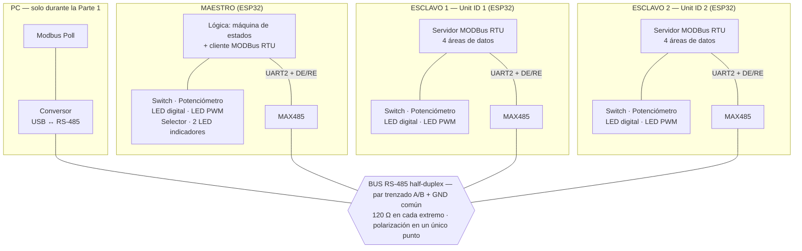

# Arquitectura física del sistema

**Tarea Nº1 — Red MODBus RTU sobre RS-485** · Protocolos de Comunicaciones Industriales · UNRaf
**Autores:** Bevilacqua Francisco, Peralta Agustina

Este documento centraliza **todo lo físico** del proyecto: dónde se ubica el
sistema dentro de una arquitectura de automatización, cómo está construido el bus
RS-485, por qué se eligió cada componente pasivo y qué pin del ESP32 cumple cada
función. Aísla la complejidad del cableado del resto de la documentación: el
comportamiento del protocolo se describe en
[protocolo-comunicacion.md](protocolo-comunicacion.md) y el contrato de datos en
[mapa-registros.md](mapa-registros.md).

Hardware disponible: 3 × ESP32 DevKit · 3 × módulo MAX485 (TTL↔RS-485) ·
1 × conversor USB↔RS-485. Datasheet del transceptor en [MAX481.PDF](MAX481.PDF).

---

## Índice

1. [Ubicación del sistema en una arquitectura industrial](#1-ubicación-del-sistema-en-una-arquitectura-industrial)
2. [Diagrama de bloques](#2-diagrama-de-bloques)
3. [El transceptor MAX485](#3-el-transceptor-max485)
4. [Adaptación de niveles lógicos 5 V ↔ 3,3 V](#4-adaptación-de-niveles-lógicos-5-v--33-v)
5. [Teoría de líneas de transmisión: por qué hay que terminar el bus](#5-teoría-de-líneas-de-transmisión-por-qué-hay-que-terminar-el-bus)
6. [Polarización de reposo (fail-safe biasing)](#6-polarización-de-reposo-fail-safe-biasing)
7. [Esquema de conexionado](#7-esquema-de-conexionado)
8. [Asignación de pines](#8-asignación-de-pines)
9. [Lista de materiales](#9-lista-de-materiales)
10. [Procedimiento de puesta en marcha](#10-procedimiento-de-puesta-en-marcha)

---

## 1. Ubicación del sistema en una arquitectura industrial

Aunque el montaje es de laboratorio, reproduce conceptualmente los niveles
inferiores del **modelo de Purdue / ISA-95**, que es el marco de referencia para
ubicar componentes en una planta:

```
Nivel 4-5   Empresa / Sitio        ERP, planificación              ─┐  IT
──────────────  DMZ industrial  ────────────────────────────────────
Nivel 3     Operaciones            MES, historian                  ─┐
Nivel 2     Supervisión            SCADA / HMI    ←── PC + Modbus Poll (Parte 1)
Nivel 1     Control                PLC / PAC      ←── MAESTRO ESP32
Nivel 0     Campo                  sensores y actuadores ←── ESCLAVOS 1 y 2
                                                                   ─┘  OT
```

La equivalencia es directa y conviene tenerla lista para la defensa oral:

| Elemento del TP | Equivale a | Por qué |
|---|---|---|
| Esclavos 1 y 2 | Módulos de E/S remotas de nivel 0 | Encapsulan sensores (switch, potenciómetro) y actuadores (LEDs) detrás de un mapa de registros. No deciden nada: publican y obedecen. |
| Maestro ESP32 | Controlador de nivel 1 (PLC/PAC) | Es el único que contiene lógica y el único que inicia transacciones. Si se cae lo de arriba, sigue operando. |
| PC con Modbus Poll | Herramienta de supervisión de nivel 2 | Sondea y comanda, pero solo durante la puesta en marcha. Un SCADA supervisa; no es responsable del control. |

Esto responde además la **pregunta de análisis de la Parte 1** de la consigna: en
esa instancia la PC es el maestro (inicia cada transacción) y el ESP32 es el
esclavo (solo responde cuando se lo interroga, nunca habla por iniciativa
propia). La asimetría —un único iniciador, varios que solo responden— es la
definición del modelo maestro-esclavo por sondeo.

## 2. Diagrama de bloques



Los tres microcontroladores comparten **las mismas dos líneas A/B**. No hay
conmutación ni enrutamiento: todos los nodos reciben eléctricamente todas las
tramas, y el filtrado por Unit ID lo hace el software de cada esclavo.

## 3. El transceptor MAX485

### 3.1 Qué hace y por qué hace falta

El UART del ESP32 habla en **niveles TTL referidos a masa**: un "1" es 3,3 V y un
"0" es 0 V, ambos medidos contra GND. Ese esquema es frágil en un entorno
industrial porque cualquier ruido acoplado o cualquier diferencia de potencial
entre las masas de dos equipos se suma directamente a la señal.

El MAX485 convierte esa señal a **transmisión diferencial balanceada**: el bit
viaja como la *diferencia* de tensión entre dos conductores (A y B) trenzados
entre sí. La clave está en el trenzado: como ambos conductores recorren el mismo
camino físico, el ruido electromagnético se induce **por igual en los dos**. Al
restar A − B, ese ruido de modo común se cancela y solo sobrevive la señal útil.

```
Señal TTL (referida a masa)          Señal RS-485 (diferencial)

   3,3 V ──┐   ┌──┐                  A ──┐   ┌──┐      Ruido: se suma
           │   │  │                      │   │  │      a A y a B por igual
   0 V     └───┘  └──                B ──┘   └──┘      → A−B lo cancela

   Ruido → se suma a la señal         A−B > +200 mV → "1"
   → error de bit                     A−B < −200 mV → "0"
```

### 3.2 Pines del MAX485 y su función

Del datasheet ([MAX481.PDF](MAX481.PDF), Pin Description):

| Pin | Nombre | Función |
|---|---|---|
| 1 | **RO** | *Receiver Output*. Salida de datos hacia el UART. Alto si A − B > +200 mV, bajo si A − B < −200 mV. |
| 2 | **RE** | *Receiver Enable*, activo en **bajo**. RO está habilitado con RE en 0; en alta impedancia con RE en 1. |
| 3 | **DE** | *Driver Enable*, activo en **alto**. Con DE en 1 el nodo transmite; con DE en 0 sus salidas quedan en alta impedancia y el nodo solo escucha. |
| 4 | **DI** | *Driver Input*. Entrada de datos desde el UART. |
| 5 | GND | Masa. |
| 6 | **A** | Entrada/salida no inversora del par diferencial. |
| 7 | **B** | Entrada/salida inversora del par diferencial. |
| 8 | VCC | Alimentación: **4,75 V ≤ VCC ≤ 5,25 V**. |

### 3.3 Half-duplex y control de dirección

RS-485 en dos hilos es **half-duplex**: el mismo par se usa para transmitir y
recibir, y solo un nodo puede hablar por vez. El MAX485 no decide solo cuándo
hablar — es el firmware el que debe conmutar la dirección:

```
DE = RE = 0  →  modo RECEPCIÓN  (driver en alta impedancia, receptor activo)
DE = RE = 1  →  modo TRANSMISIÓN (driver activo, receptor deshabilitado)
```

Como RE es activo en bajo y DE en alto, **se unen ambos pines a un único GPIO**
(GPIO4): un solo nivel controla las dos funciones de forma coherente y es
imposible dejar el nodo en un estado inválido (transmitiendo y escuchando a la
vez, o ninguna de las dos).

La librería `umodbus` conmuta ese pin automáticamente antes y después de cada
transmisión, a partir del parámetro `ctrl_pin`. El tiempo de conmutación del
transceptor es de **40 ns típicos y 70 ns máximos** (tZH/tZL y tLZ/tHZ del
datasheet), despreciable frente al tiempo de bit de 104 µs a 9600 baudios: no
introduce riesgo de recortar el primer ni el último bit de la trama.

### 3.4 Carga del bus

Cada MAX485 presenta **1 carga unitaria** (RIN ≥ 12 kΩ según el datasheet). El
estándar TIA/EIA-485 admite hasta 32 cargas unitarias por segmento. Con 4 nodos
(3 ESP32 + el conversor USB) se usan 4 de 32: sobra capacidad, y el driver opera
lejos de su límite de corriente.

## 4. Adaptación de niveles lógicos 5 V ↔ 3,3 V

> ⚠️ **Este es el punto crítico del montaje.** Hacerlo mal no produce un error
> de software: degrada o destruye el ESP32.

El MAX485 es un dispositivo **estrictamente de 5 V** y el ESP32 es de 3,3 V con
un **máximo absoluto de 3,6 V** en sus GPIO. Las cuatro líneas que los unen no se
comportan igual.

### 4.1 Datos del datasheet que gobiernan la decisión

| Parámetro | Símbolo | Valor |
|---|---|---|
| Tensión de alimentación | VCC | 4,75 V ≤ VCC ≤ 5,25 V |
| Tensión de entrada alta (DI, DE, RE) | VIH | **2,0 V mínimo** |
| Tensión de entrada baja (DI, DE, RE) | VIL | 0,8 V máximo |
| Tensión de salida alta del receptor (RO) | VOH | **3,5 V mínimo** (en la práctica ≈ VCC) |
| Umbral diferencial del receptor | VTH | ±200 mV |

### 4.2 Sentido ESP32 → MAX485 (DI, DE, RE): conexión directa

El ESP32 entrega 3,3 V y el MAX485 exige **VIH ≥ 2,0 V** para interpretar un "1".

```
Margen de ruido en alto:  3,3 V − 2,0 V = 1,3 V   ✔ suficiente
Margen de ruido en bajo:  0,8 V − 0,0 V = 0,8 V   ✔ suficiente
```

**Conexión directa, sin ningún componente intermedio.** Agregar un level shifter
en este sentido es un error frecuente: no aporta nada y suma un punto de falla.

### 4.3 Sentido MAX485 → ESP32 (RO → RX): divisor resistivo obligatorio

El pin RO entrega **VOH ≥ 3,5 V**, y en la práctica prácticamente VCC (≈5 V),
contra un máximo absoluto de 3,6 V del GPIO. Conectarlo directo hace conducir los
diodos de protección del pin, lo que degrada la entrada y puede destruir el chip.

```
                        5 V
                         │
                    R_pu = 680 Ω    ← pull-up, obligatorio (ver §4.3.1)
                         │
   MAX485 RO ────────────┴── R1 = 2,2 kΩ ──┬──► ESP32 GPIO16 (UART2 RX)
                                           │
                                      R2 = 3,3 kΩ
                                           │
                                          GND
```

**Verificación en el peor caso (VCC = 5,25 V):**

```
V_RX = VCC × R2/(R1+R2) = 5,25 × 3300/5500 = 3,15 V
```

| Criterio | Valor obtenido | Requisito | Margen |
|---|---|---|---|
| No superar el máximo absoluto del GPIO | 3,15 V | ≤ 3,6 V | 0,45 V |
| Ser reconocido como nivel alto | 3,15 V | ≥ VIH(ESP32) = 0,75 × 3,3 = 2,48 V | 0,67 V |
| Corriente exigida al pin RO | 0,95 mA | ≪ 7 mA (IOSR mínimo) | amplio |

**Verificación de que el divisor no degrada el timing.** Un divisor resistivo
forma, junto con la capacidad parásita del pin y del cableado, un filtro pasa
bajos que redondea los flancos. Hay que comprobar que ese redondeo sea
despreciable frente al tiempo de bit:

```
R_Thévenin = R1 ∥ R2 = 2200 ∥ 3300 = 1,32 kΩ
C_parásita ≈ 50 pF  (pin del ESP32 + cableado de protoboard)

τ = R × C = 1,32 kΩ × 50 pF = 66 ns
t_subida (10 % a 90 %) = 2,2 × τ = 145 ns

Tiempo de bit a 9600 baudios = 1 / 9600 = 104 µs
Distorsión = 145 ns / 104 µs = 0,14 %
```

Despreciable. **La verificación importa porque el resultado depende de la
velocidad:** a 1 Mbaud el tiempo de bit sería 1 µs y esa misma distorsión pasaría
a ser del 14,5 %, ya inaceptable. Por eso el cálculo se hace y no se asume.

### 4.3.1 El pull-up de 680 Ω: por qué el divisor solo no alcanza

Del datasheet: *"RO is high impedance when RE is high"*. Como RE está atado a DE,
**mientras el nodo transmite su propio RO queda en alta impedancia**.

Sin pull-up, en ese instante el divisor deja de ser un divisor y pasa a ser una
resistencia de 3,3 kΩ que tira el GPIO16 a masa. Para el UART, RX en bajo es un
bit de arranque: mientras dure la transmisión genera **bytes `0x00` espurios**
que quedan en el buffer de recepción del propio nodo.

| Nodo | Consecuencia |
|---|---|
| **Maestro** | Al terminar de transmitir lee enseguida la respuesta, encuentra los `0x00`, los toma por la respuesta del esclavo y falla el CRC en el 100 % de los ciclos |
| **Esclavo** | Los `0x00` se concatenan con la siguiente petición si esta llega dentro de los 4 ms de `inter_frame_delay`; la trama unida falla el CRC y la librería la descarta con `return None`, **sin excepción**: no responde y su consola queda limpia |

Dimensionamiento: el pull-up debe sostener el nodo por encima del umbral de
entrada alta del ESP32 (0,75 × 3,3 = **2,47 V**) con RO en Hi-Z.

| Pull-up | Nodo con RO en Hi-Z | Corriente con RO en bajo | Veredicto |
|---|---|---|---|
| 470 Ω | 2,76 V | 9,8 mA | Sirve |
| **680 Ω** | **2,67 V** | **6,8 mA** | **Recomendado** |
| 1 kΩ | 2,54 V | 4,6 mA | Margen ajustado |
| ≥ 1,5 kΩ | ≤ 2,36 V | — | ✗ Por debajo del umbral |

Con 680 Ω los otros dos estados siguen correctos: RO en bajo deja el nodo en
0,24 V y RO en alto en 2,70 V.

⚠️ **Va en los tres nodos**, porque los tres transmiten.

### 4.4 Alternativas evaluadas y descartadas

| Alternativa | Qué se gana | Por qué se descartó |
|---|---|---|
| Alimentar el MAX485 a 3,3 V | Cero componentes | Queda **fuera de especificación** (VCC mínimo 4,75 V). La tensión diferencial de salida cae y el margen de ruido se degrada de forma no cuantificable: "anda en el banco" no es un argumento defendible. |
| Reemplazar por MAX3485 (3,3 V nativo) | Solución técnicamente superior, sin componentes externos | Exige comprar 3 módulos nuevos (~AR$1.500-2.500 c/u). Con el divisor, el hardware ya disponible cumple con margen **verificado por cálculo**. |
| Level shifter bidireccional (TXS0108E) | Solución "de catálogo" | Sobredimensionado: de las 4 líneas, solo 1 necesita adaptación. Viola KISS y agrega un componente activo más que puede fallar. |

**Decisión adoptada:** divisor resistivo 2,2 kΩ / 3,3 kΩ en RO → RX, con el
módulo alimentado a 5 V desde el pin VIN del ESP32.

## 5. Teoría de líneas de transmisión: por qué hay que terminar el bus

Esta sección responde la **pregunta de evaluación Nº4** de la consigna.

### 5.1 Cuándo un cable deja de ser un cable

En baja frecuencia un conductor es simplemente un nodo equipotencial: lo que se
pone en un extremo aparece instantáneamente en el otro. Eso deja de ser cierto
cuando el tiempo que tarda la señal en recorrer el cable es comparable al tiempo
de subida del flanco. En ese régimen el cable se comporta como una **línea de
transmisión** con una **impedancia característica**:

```
Z₀ = √(L/C)
```

donde L y C son la inductancia y la capacidad *por unidad de longitud*. Para el
par trenzado normalizado de RS-485, **Z₀ ≈ 120 Ω**.

**El criterio para decidir si hace falta terminar** compara el tiempo de ida y
vuelta de la señal con el tiempo de subida del driver:

```
Terminar si:   2 × L / v  >  t_subida
```

Aplicado a este montaje, con los datos reales del MAX485:

```
t_subida (tR) = 15 ns típico, 3 ns mínimo   ← datasheet, MAX481/MAX485
v (velocidad de propagación) ≈ 0,66 c ≈ 2 × 10⁸ m/s  (≈ 5 ns por metro)

Longitud crítica con tR típico:   L_c = tR × v / 2 = 15 ns × 2×10⁸ / 2 = 1,5 m
Longitud crítica con tR mínimo:   L_c = 3 ns × 2×10⁸ / 2 = 0,3 m
```

**La conclusión depende del largo real del bus, y por eso el criterio se aplica
en cada etapa en vez de decidirse una vez:**

| Etapa | Nodos | Largo estimado | ¿Supera L_c? | Decisión |
|---|---|---|---|---|
| **Parte 1** | 2 (esclavo + conversor USB) | 0,3 a 0,6 m | No, ni con tR típico ni con el mínimo salvo el caso extremo | **Sin terminación** — ver [PARTE-1.md §3.1](../PARTE-1.md#31-sin-resistencias-de-terminación) |
| **Partes 2 y 3** | 3 a 4 | 1 a 2 m | Sí con tR típico (1,5 m); ampliamente con tR mínimo (0,3 m) | **Terminar** con 120 Ω + polarización |

> **El punto que conviene defender:** la terminación **no** es una precaución
> reservada a instalaciones de cientos de metros. Con un transceptor de flancos
> rápidos, la longitud crítica cae al orden del metro, y un bus de banco de tres
> nodos en protoboard ya la alcanza. El MAX485 no tiene limitación de *slew rate*
> —a diferencia del MAX483/MAX487, que sí la tienen y por eso llegan solo a
> 250 kbps—: sus flancos de 15 ns son justamente los que vuelven el problema
> visible en cables cortos. Un MAX483 en el mismo bus, con flancos del orden de
> los cientos de nanosegundos, tendría una longitud crítica de decenas de metros
> y no necesitaría terminación en ninguna de las etapas de este trabajo.

> ⚠️ **Terminación y polarización van juntas.** Instalar los 120 Ω sin la red de
> polarización de §6 deja A y B unidas por 60 Ω y la tensión diferencial de
> reposo en ≈0 V, dentro de la zona muerta de ±200 mV: el bus queda **peor** que
> sin terminar. Se ponen las dos cosas, o ninguna.

### 5.2 Qué pasa si no se termina: el coeficiente de reflexión

Cuando la onda llega al final del cable y encuentra una impedancia distinta de
Z₀, parte de la energía **rebota hacia atrás**. La fracción que se refleja es:

```
Γ = (Z_L − Z₀) / (Z_L + Z₀)
```

| Terminación | Z_L | Γ | Consecuencia |
|---|---|---|---|
| Extremo abierto (sin terminar) | ∞ | **+1** | La onda vuelve completa y **en fase**: se suma a la señal incidente y produce sobrepicos y oscilación (*ringing*) |
| Cortocircuito | 0 | **−1** | Vuelve completa e invertida: cancela la señal |
| Terminación adaptada | 120 Ω = Z₀ | **0** | No hay reflexión: toda la energía se disipa en la resistencia |

El daño concreto es este: el receptor decide el valor del bit comparando A − B
contra un umbral de **±200 mV**. Una oscilación por reflexión hace que esa
diferencia cruce el umbral varias veces durante lo que debería ser un único bit
estable. El UART interpreta esos cruces como flancos, y el resultado son bits
espurios, errores de encuadre y tramas que fallan el CRC.

El síntoma clínico es característico y muy citado en la bibliografía de campo:
**"funciona a veces"**. Con tramas cortas y datos de baja actividad la reflexión
puede no llegar a cruzar el umbral; con la trama justa, falla. Un error
intermitente es mucho más caro de diagnosticar que uno permanente.

```
Sin terminación (Γ = +1)              Con terminación (Γ = 0)

  A−B                                  A−B
   │   ╱╲    ╱╲                         │   ┌────────┐
+200mV─┼─╱──╲╱──╲───── umbral        +200mV─┼───┼────────┼─────
   │  ╱      ╲   ╲                       │   │        │
   │ ╱        ╲   ╲___                   │   │        │
-200mV────────╲╱──────                -200mV┼───┴────────┴─────
   │                                     │
   Cruces espurios del umbral            Un flanco limpio por bit
   → bits falsos, CRC inválido           → recepción correcta
```

### 5.3 Por qué 120 Ω, y por qué solo en los extremos

**Por qué 120 Ω:** porque iguala la impedancia característica del par trenzado.
No es un valor convencional ni un número de catálogo: es la condición Z_L = Z₀
que hace Γ = 0.

**Por qué exactamente dos, y en los extremos físicos:** cada extremo abierto es
un punto de reflexión. Un bus lineal tiene exactamente dos extremos, y por lo
tanto necesita exactamente dos terminaciones. Los nodos intermedios no son
extremos: la señal los atraviesa y sigue viaje.

**Qué pasa si se agrega una tercera terminación** (error muy común cuando cada
integrante del grupo "termina su nodo"): las resistencias quedan en paralelo y la
carga total del bus baja. El driver tiene que entregar más corriente para la
misma tensión diferencial, y la amplitud de la señal cae. El datasheet acota esto
de forma explícita: la tensión diferencial de salida garantizada es
**VOD ≥ 1,5 V con una carga de 27 Ω** (el caso peor normalizado: dos
terminaciones de 120 Ω en paralelo más 32 cargas unitarias) y **VOD ≥ 2 V con
54 Ω**. Con tres terminaciones se sale de esa condición de ensayo y el margen
sobre el umbral de ±200 mV se reduce sin que nada lo avise.

**Longitud máxima de las derivaciones (*stubs*):** el ramal que va del bus
principal a cada nodo también es una línea sin terminar. Se lo mantiene por
debajo de una décima parte de la longitud crítica:

```
L_stub_max ≈ tR × v / 10 = 15 ns × 2×10⁸ / 10 = 0,3 m  →  menos de 30 cm
```

De ahí la regla práctica del montaje: **topología de bus lineal (daisy chain),
nunca estrella**, con derivaciones cortas. Una topología en estrella crea tantos
puntos de reflexión como brazos tenga, y ninguna terminación puede absorberlos
todos a la vez.

### 5.4 Longitud máxima y velocidad

RS-485 admite hasta 1200 m a velocidades de hasta 100 kbps, con la regla práctica
de que el producto velocidad × longitud se mantiene aproximadamente constante. A
9600 baudios y con un bus de pocos metros, **la longitud no es una restricción
en este trabajo**; la restricción real es la de la sección 5.1, que es de tiempo
de subida y no de atenuación.

## 6. Polarización de reposo (fail-safe biasing)

### 6.1 El problema

Cuando ningún nodo transmite —todos los DE en bajo— los drivers quedan en alta
impedancia y **nadie está gobernando las líneas A y B**. Con las dos
terminaciones de 120 Ω instaladas, A y B quedan unidas por 60 Ω y la tensión
diferencial cae a ≈ 0 V.

Cero está **dentro de la zona indeterminada de ±200 mV** del receptor. El pin RO
no adopta un valor definido: oscila siguiendo el ruido ambiente. El UART del
ESP32 interpreta esos flancos aleatorios como bits de arranque, se llena de bytes
basura y descarta las tramas legítimas que llegan después.

> **Aclaración importante sobre el datasheet.** El MAX485 declara una función
> *fail-safe* que garantiza RO en alto con la entrada **en circuito abierto**.
> Eso **no aplica acá**: con las terminaciones instaladas, la entrada no está
> abierta, está cargada por 60 Ω. La función fail-safe interna resuelve el caso
> del cable desconectado, no el del bus terminado y en silencio. Confundir ambos
> casos es lo que lleva a omitir la polarización y a perder horas.

### 6.2 La solución y su dimensionamiento

Se agrega una red que fuerza una diferencia de reposo conocida, **en un único
punto de todo el bus** (se instala en el nodo maestro):

```
   +5 V ── R_up = 680 Ω ──── línea A

   GND  ── R_dn = 680 Ω ──── línea B
```

El objetivo es que en reposo A − B supere con margen los +200 mV, de modo que el
receptor entregue un "1" estable — que es el estado de reposo (*marca*) que el
UART espera cuando no hay datos.

**Cálculo del valor:**

```
Terminaciones en paralelo:   120 ∥ 120 = 60 Ω
Malla de polarización:       R_up + 60 + R_dn = 680 + 60 + 680 = 1420 Ω
Corriente de reposo:         I = 5 V / 1420 Ω = 3,52 mA
Tensión diferencial:         V_AB = 3,52 mA × 60 Ω = 211 mV   ✔ > 200 mV
```

**Verificación del valor alternativo que parecería razonable:**

```
Con R_up = R_dn = 1 kΩ:
   I = 5 / (1000 + 60 + 1000) = 2,43 mA
   V_AB = 2,43 mA × 60 Ω = 145 mV   ✘ DENTRO de la zona muerta de ±200 mV
```

Con 1 kΩ el bus seguiría sin funcionar, y el error sería dificilísimo de
encontrar sin osciloscopio, porque *hay* polarización y la medición con
multímetro daría un valor no nulo. Es un buen ejemplo de por qué un componente
pasivo también se calcula.

**Por qué en un solo punto:** cada red de polarización agregada carga el bus en
paralelo, aumenta la corriente de reposo y reduce la amplitud disponible para la
señal. Dos nodos polarizando el mismo bus duplican la carga sin ningún beneficio.

## 7. Esquema de conexionado

### 7.1 Interfaz ESP32 ↔ MAX485 (idéntica en los tres nodos)

```
        ESP32                                MAX485                    BUS
  ┌───────────────┐                    ┌──────────────┐
  │               │                    │              │
  │  GPIO17 (TX)  ├───────────────────►│ DI (4)       │
  │               │      directo       │              │
  │  GPIO4        ├──────────┬────────►│ DE (3)       │      A (6) ├──────► línea A
  │               │  directo └────────►│ RE (2)       │      B (7) ├──────► línea B
  │               │                    │              │
  │  GPIO16 (RX)  │◄───┬───────────────┤ RO (1)       │
  │               │    │               │              │
  │               │  [3,3 kΩ]  [2,2 kΩ]│              │
  │               │    │           ▲   │              │
  │      GND      ├────┴───────────┘   │ GND (5)      ├──────► GND común
  │               │                    │              │
  │      VIN(5V)  ├───────────────────►│ VCC (8)      │
  └───────────────┘                    └──────────────┘

  ▲ El divisor 2,2k/3,3k va SOLO en la línea RO → RX. Las otras tres van directas.
```

### 7.2 Periféricos de cada nodo

```
  Switch / jumper:                    Potenciómetro 10 kΩ:      LED (digital y PWM):

    3,3 V                                3,3 V                    GPIO ──[330 Ω]──►│──┐
      ⌇ (pull-up interno)                  │                                    LED   │
      │                                  ┌─┴─┐                                       │
    GPIO ──────┬─────                    │   │◄─── GPIO34 (cursor)                  GND
               │                         └─┬─┘
             ─┴─ contacto                   │
              │                            GND
             GND

    Activo en BAJO                    ADC1, 0-4095 (12 bits)     I ≈ 3,9 mA
```

### 7.3 Bus completo

```
   [USB-RS485]      [MAESTRO]        [ESCLAVO 1]       [ESCLAVO 2]
    (solo P1)           │                 │                 │
        │            stub<30cm         stub<30cm         stub<30cm
        │               │                 │                 │
  ══╤═══╧═══════════════╧═════════════════╧═════════════════╧═══╤══  A
    │                                                           │
  ══╧═══════════════════════════════════════════════════════════╧══  B
   120 Ω                    ▲                                 120 Ω
  (extremo)                 │                               (extremo)
                    polarización 680/680
                    en UN SOLO punto

       GND ────────────── GND común a TODOS los nodos ──────────────
```

**Las cuatro reglas del cableado, y su fundamento:**

1. **Bus lineal, nunca estrella** — cada brazo de una estrella es un punto de
   reflexión adicional (§5.3).
2. **120 Ω solo en los dos extremos físicos** — condición Γ = 0 (§5.2, §5.3).
3. **Polarización en un único punto** — evita la zona muerta de ±200 mV en reposo (§6).
4. **GND común entre todos los nodos** — RS-485 es diferencial, pero el receptor
   solo tolera una tensión de modo común de −7 V a +12 V **respecto de su propia
   masa**. Sin referencia común, esa condición no está garantizada. Es la causa
   número uno de "anda entre dos nodos y se cae al agregar el tercero".

## 8. Asignación de pines

### 8.1 Criterios de selección de GPIO en el ESP32

| Regla | Motivo |
|---|---|
| **Excluir GPIO 6-11** | Están conectados a la memoria flash SPI interna. Usarlos cuelga el chip. |
| **Excluir GPIO 0, 2, 12, 15** | Son pines de *strapping*: su nivel durante el arranque define el modo de booteo. Un LED o un pulsador ahí puede impedir que el ESP32 arranque, con un síntoma desconcertante. |
| **GPIO 34-39 solo como entrada** | Son de solo entrada y **no tienen pull-up/pull-down interno**. Ideales para el ADC, inútiles como salida o como entrada de contacto. |
| **Preferir ADC1 (GPIO 32-39)** | El ADC2 queda inutilizable mientras el WiFi está activo. Aunque este trabajo no usa WiFi, se elige ADC1 para no cerrar la puerta a una futura pasarela Modbus↔MQTT. |
| **Usar UART2, no UART0** | El UART0 está ocupado por la consola REPL sobre USB. Si se usara para el bus, cada `print()` de depuración se inyectaría como basura en el bus RS-485. |

### 8.2 Esclavo 1 y Esclavo 2 — firmware idéntico

| Función | GPIO | Dirección MODBus | Conexión |
|---|---|---|---|
| UART2 TX → DI | 17 | — | Directo |
| UART2 RX ← RO | 16 | — | **Vía divisor 2k2/3k3** |
| DE + RE (unidos) | 4 | — | Directo · alto = transmitir |
| Switch / pulsador | 18 | 10001 (Discrete Input 0) | A GND, pull-up interno, activo en bajo |
| Potenciómetro | 34 | 30001 (Input Register 0) | Extremos a 3,3 V y GND |
| LED 1 digital | 19 | 00001 (Coil 0) | Ánodo al pin, 330 Ω a GND |
| LED 2 PWM | 21 | 40001 (Holding Register 0) | Ánodo al pin, 330 Ω a GND |
| **Jumper de Unit ID** | 13 | — | Abierto = ID 1 · a GND = ID 2 |

**Sobre el jumper de Unit ID:** la consigna pide "dirección física fija". Un
jumper es literalmente eso, y es la forma en que los equipos industriales reales
fijan su dirección (las llaves DIP de un variador o de un módulo de E/S remoto).
Se gana además que **ambos esclavos ejecuten exactamente el mismo firmware**
(principio DRY), lo que elimina la clase de error "actualicé un esclavo y me
olvidé del otro" —que en un bus de campo se manifiesta como un fallo
intermitente muy difícil de atribuir. Se descartó GPIO 5, pese a estar libre,
porque es pin de *strapping*.

### 8.3 Maestro

| Función | GPIO | Conexión |
|---|---|---|
| UART2 TX → DI | 17 | Directo |
| UART2 RX ← RO | 16 | **Vía divisor 2k2/3k3** |
| DE + RE (unidos) | 4 | Directo |
| Switch local → Coil del esclavo | 18 | Pull-up interno, activo en bajo |
| Potenciómetro local → HR del esclavo | 34 | ADC1_CH6 |
| LED replicador digital ← DI del esclavo | 19 | 330 Ω |
| LED replicador PWM ← IR del esclavo | 21 | 330 Ω |
| Switch selector de esclavo | 13 | Abierto = Esclavo 1 · a GND = Esclavo 2 |
| LED indicador "Esclavo 1 activo" | 22 | 330 Ω |
| LED indicador "Esclavo 2 activo" | 23 | 330 Ω |

Los pines comunes son **los mismos en maestro y esclavos**: reduce errores de
cableado en el banco y permite compartir un único módulo de periféricos entre los
tres firmwares.

### 8.4 Cálculo de la resistencia serie de los LEDs

LED rojo típico: Vf ≈ 2,0 V. Corriente elegida ≈ 4 mA: más que suficiente para
verlo con claridad, y deja el GPIO muy por debajo de su límite.

```
R = (V_GPIO − Vf) / I = (3,3 − 2,0) / 0,004 = 325 Ω  →  valor comercial: 330 Ω
I_real = (3,3 − 2,0) / 330 = 3,9 mA
```

El ESP32 admite hasta 40 mA por pin, con un límite agregado por banco de puertos.
Con 4 LEDs a 3,9 mA, el maestro consume 15,6 mA en sus salidas: sin problemas.

## 9. Lista de materiales

| Componente | Cantidad | Uso |
|---|---|---|
| ESP32 DevKit | 3 | Maestro, Esclavo 1, Esclavo 2 |
| Módulo MAX485 (TTL↔RS-485) | 3 | Transceptor de cada nodo |
| Conversor USB↔RS-485 | 1 | Validación desde PC (Parte 1) |
| Resistencia 2,2 kΩ | 3 | Divisor RO→RX (una por nodo) |
| Resistencia 3,3 kΩ | 3 | Divisor RO→RX (una por nodo) |
| **Resistencia 680 Ω** | **3** | **Pull-up de RO (una por nodo) — obligatorio, ver §4.3.1** |
| Resistencia 330 Ω | 8 | LEDs (2 por esclavo + 4 en el maestro) |
| Resistencia 120 Ω | 2 | Terminación del bus (solo extremos) |
| Resistencia 680 Ω | 2 | Polarización de reposo (un solo punto) |
| LED 5 mm | 8 | 2 por esclavo, 4 en el maestro |
| Potenciómetro 10 kΩ | 3 | Entrada analógica de cada nodo |
| Pulsador / llave | 6 | 1 switch + 1 jumper o selector por nodo |
| Par trenzado | ~2 m | Líneas A/B del bus |

## 10. Procedimiento de puesta en marcha

No saltear pasos: cada uno aísla una clase distinta de falla. Saltearlos
convierte un problema simple en varios problemas superpuestos que se diagnostican
en simultáneo.

| # | Paso | Criterio de aceptación |
|---|---|---|
| 1 | Inspección visual y continuidad **sin alimentar** | Sin cortos entre 5 V/3,3 V y GND; A y B no cortocircuitadas entre sí |
| 2 | Alimentar el MAX485 y forzar RO alto; medir el divisor | Tensión en el nodo del divisor entre 2,9 y 3,2 V. **Si mide ≈5 V, NO conectar al ESP32** |
| 3 | Alimentar los ESP32 y correr un *blink* | Confirma alimentación, reloj y que MicroPython arranca |
| 4 | Probar los periféricos locales uno por vez, sin MODBus | Con `firmware/prueba_perifericos.py` (F5 en Thonny): cada periférico responde aislado |
| 5 | Armar el bus completo y medir la polarización de reposo, con todos los nodos callados | V(A) − V(B) ≈ 200-220 mV, estable |
| 6 | Modbus Poll ↔ Esclavo 1, con el resto de los nodos apagados | Lectura y escritura correctas en las 4 direcciones |
| 7 | Agregar el maestro (Parte 2) | Sondeo estable, sin timeouts durante 5 minutos continuos |
| 8 | Agregar el Esclavo 2 (Parte 3) | Conmutación en vivo; el esclavo no seleccionado retiene su estado |

### 10.1 Qué responde cada instrumento

| Instrumento | Pregunta que contesta |
|---|---|
| Multímetro | ¿Hay tensión? ¿Hay continuidad? ¿La polarización de reposo da 211 mV? |
| Analizador lógico | ¿Qué bytes viajan realmente por el bus y con qué timing? |
| Osciloscopio | ¿Cómo es la señal *de verdad*: hay ringing por reflexión, cuánto sobrepico? |
| REPL de Thonny | ¿Qué cree el firmware que está pasando? |

Regla de diagnóstico: **una hipótesis, un experimento, una variable por vez.** Y
la pregunta que resuelve la mitad de los casos: ¿el problema es de hardware (la
señal no existe) o de software (existe pero se interpreta mal)? El analizador
lógico contesta eso en un minuto y ahorra horas de leer código sano.

---

## Referencias

- Maxim Integrated. (2003). *MAX481/MAX483/MAX485/MAX487–MAX491/MAX1487: Low-Power, Slew-Rate-Limited RS-485/RS-422 Transceivers* (Rev. 8). [MAX481.PDF](MAX481.PDF)
- Texas Instruments. (2014). *TIA/EIA-485 (RS-485) Design Guide* (Application Report SLLA272).
- Telecommunications Industry Association. (1998). *TIA/EIA-485-A: Electrical Characteristics of Generators and Receivers for Use in Balanced Digital Multipoint Systems*.
- International Society of Automation. (2010). *ISA-95: Enterprise-Control System Integration*.
