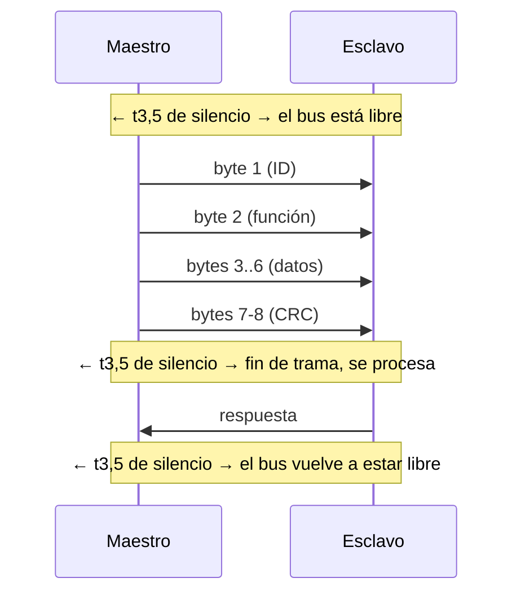
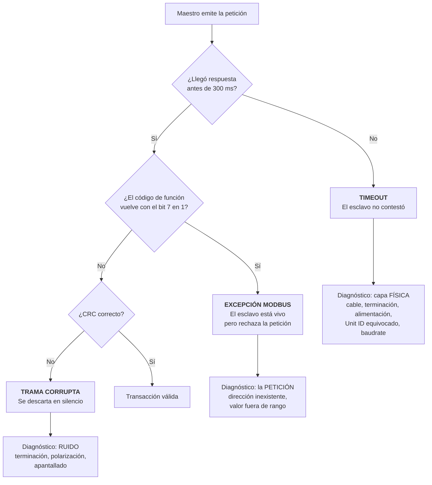
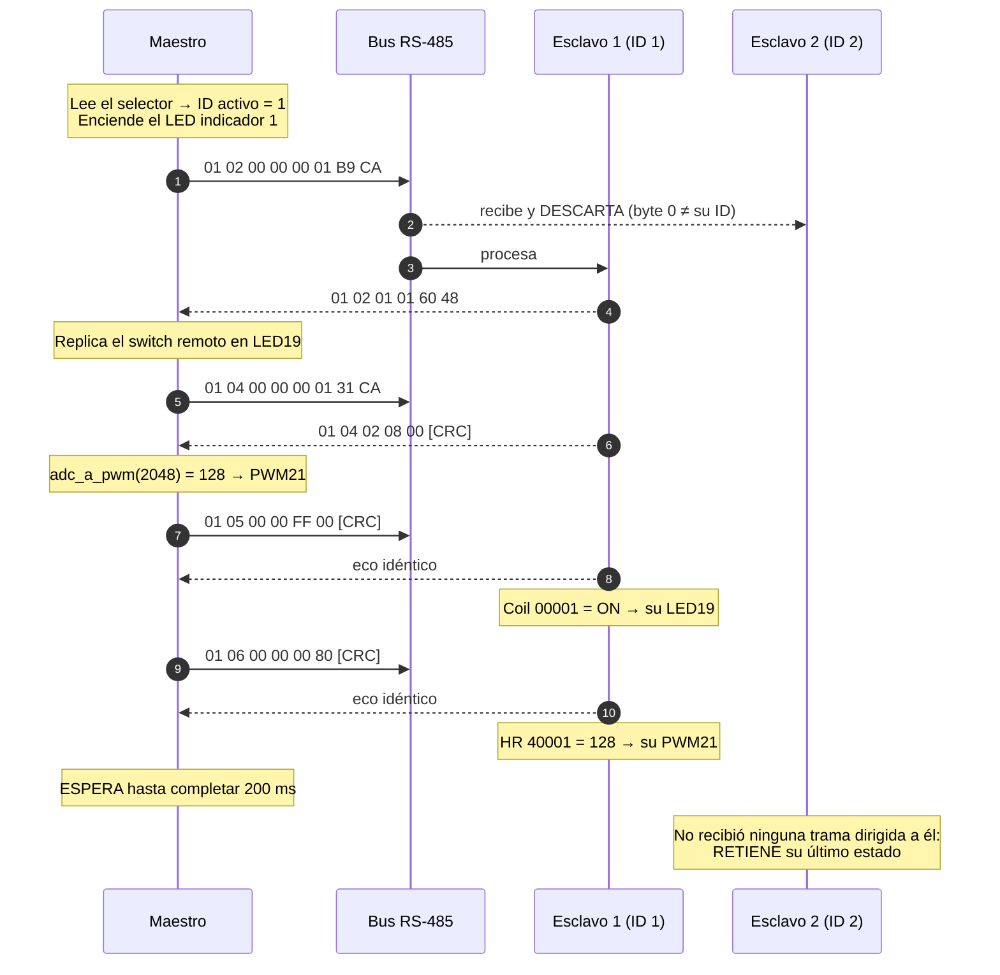

# Protocolo de comunicación — MODBus RTU

**Tarea Nº1 — Red MODBus RTU sobre RS-485** · Protocolos de Comunicaciones Industriales · UNRaf
**Autores:** Bevilacqua Francisco, Peralta Agustina

Este documento describe **el comportamiento de la red**: cómo se configura el
puerto serie y por qué, cómo se estructura cada trama que viaja por el bus, cómo
se calcula y por qué es vital el CRC, y cómo se manejan los errores. Es el
complemento lógico de [arquitectura.md](arquitectura.md), que cubre la capa
física, y de [mapa-registros.md](mapa-registros.md), que fija el contrato de datos.

Responde directamente a los requerimientos teóricos de la consigna: el
requerimiento adicional 3 ("Análisis de tramas MODBus RTU") y las preguntas de
evaluación 1, 2 y 3.

---

## Índice

1. [Qué es MODBus y dónde encaja](#1-qué-es-modbus-y-dónde-encaja)
2. [Modo RTU frente a modo ASCII](#2-modo-rtu-frente-a-modo-ascii)
3. [Configuración del puerto serie](#3-configuración-del-puerto-serie)
4. [Delimitación de tramas por tiempo](#4-delimitación-de-tramas-por-tiempo)
5. [Estructura de la trama MODBus RTU](#5-estructura-de-la-trama-modbus-rtu)
6. [Códigos de función empleados y sus tramas](#6-códigos-de-función-empleados-y-sus-tramas)
7. [El CRC-16](#7-el-crc-16)
8. [Orden de bytes: MSB, LSB y endianness](#8-orden-de-bytes-msb-lsb-y-endianness)
9. [Límites de capacidad de la trama](#9-límites-de-capacidad-de-la-trama)
10. [Manejo de errores: excepciones y timeouts](#10-manejo-de-errores-excepciones-y-timeouts)
11. [Ciclo de transacciones del maestro](#11-ciclo-de-transacciones-del-maestro)

---

## 1. Qué es MODBus y dónde encaja

MODBus es un **protocolo de capa de aplicación** publicado por Modicon en 1979 y
hoy mantenido por la Modbus Organization. Define *qué* significan los mensajes,
no *cómo* viajan los bits: es agnóstico del medio físico.

```
┌──────────────────────────────────────────┐
│  APLICACIÓN   MODBus (funciones 01-06…)  │  ← qué se pide y qué significa
├──────────────────────────────────────────┤
│  ENLACE       MODBus RTU (trama + CRC)   │  ← direccionamiento e integridad
├──────────────────────────────────────────┤
│  FÍSICA       RS-485 (diferencial A/B)   │  ← cómo viajan los bits
└──────────────────────────────────────────┘
```

Esa separación es la que permite que el mismo modelo de datos se transporte sobre
RS-485 (MODBus RTU), sobre RS-232, o sobre TCP/IP (MODBus TCP, que reemplaza el
direccionamiento y el CRC por la cabecera MBAP y la verificación de TCP).

**Por qué MODBus RTU en este trabajo** (pregunta habitual de defensa oral, aunque
la consigna lo fije):

| Criterio | MODBus RTU / RS-485 | Alternativas descartadas |
|---|---|---|
| Determinismo requerido | Bajo-medio: sondeo de milisegundos a segundos, suficiente para switches y potenciómetros | EtherCAT / PROFINET IRT: determinismo de µs, injustificado acá |
| Hardware disponible | MAX485 + UART de cualquier ESP32, muy accesible | CAN / PROFIBUS: transceptores y pilas menos comunes en el aula |
| Complejidad de implementación | Trama simple, especificación pública, librerías maduras | OPC-UA: modelo de información rico pero pesado para un MCU |
| Seguridad nativa | **Ninguna** — ver §10.4 | — |
| Costo y repuestos | Muy bajo; estándar de facto en la industria | — |

## 2. Modo RTU frente a modo ASCII

La especificación de MODBus sobre línea serie define dos modos de transmisión. La
consigna fija RTU, pero conviene poder justificar la diferencia:

| Aspecto | **RTU** (el usado) | ASCII |
|---|---|---|
| Codificación | Binaria: cada byte del mensaje es un byte en la línea | Cada byte se envía como 2 caracteres hexadecimales ASCII |
| Bits de datos | **8** obligatorios | 7 (o 8) |
| Eficiencia | Un byte de datos = 1 byte transmitido | Un byte de datos = 2 bytes transmitidos (**la mitad de eficiente**) |
| Delimitación de trama | Por **silencio** en la línea (t3,5) | Por caracteres explícitos: `:` de inicio, CR/LF de fin |
| Verificación | **CRC-16** (16 bits) | LRC (8 bits, más débil) |
| Exigencia de timing | Alta: depende de medir silencios | Baja: tolera pausas arbitrarias entre caracteres |

RTU es el modo dominante en la industria por su eficiencia y su verificación más
robusta. Su contrapartida —la dependencia del timing— es precisamente el riesgo
técnico principal de implementarlo sobre un intérprete como MicroPython, y es lo
que determina la elección de baudrate de la sección siguiente.

## 3. Configuración del puerto serie

**Configuración adoptada: 9600 baudios, 8 bits de datos, sin paridad, 1 bit de parada (8N1).**

Debe ser **idéntica en los tres ESP32 y en Modbus Poll**. Un solo nodo desalineado
en baudrate o paridad no falla parcialmente: rompe la comunicación de todo el bus,
porque sus tramas mal encuadradas se superponen a las ajenas.

### 3.1 Baudrate: 9600 — la decisión menos obvia y la más importante

En modo RTU la trama no tiene caracteres de inicio ni de fin: se delimita por
**silencio**. La especificación fija dos umbrales:

- **t3,5** — un silencio de 3,5 tiempos de carácter marca el fin de una trama.
- **t1,5** — un silencio de más de 1,5 tiempos de carácter *dentro* de una trama
  la vuelve inválida y obliga a descartarla.

Un carácter RTU en 8N1 ocupa **11 bits** en la línea: 1 de arranque + 8 de datos
+ 1 (posición de paridad, que se rellena) + 1 de parada.

| Baudrate | t_carácter | **t1,5** | t3,5 |
|---|---|---|---|
| **9600** | 1,146 ms | **1,72 ms** | 4,01 ms |
| 19200 | 0,573 ms | 0,86 ms | 2,01 ms |
| 115200 | 0,095 ms | 0,143 ms | 1,750 ms (*) |

(*) Para baudrates superiores a 19200 la especificación fija t3,5 = 1,750 ms como
constante, porque el cálculo exacto deja de ser practicable.

**El argumento decisivo:** el firmware corre sobre **MicroPython, que es
interpretado y ejecuta un recolector de basura (GC)** cuyas pausas están en el
orden de décimas de milisegundo a milisegundos, y son **impredecibles**: se
disparan cuando el heap lo necesita, no cuando al programa le conviene.

```
A 115200 baudios:  presupuesto t1,5 = 143 µs
                   → una sola pausa del GC durante la recepción supera ese
                     umbral y la trama se descarta

A 9600 baudios:    presupuesto t1,5 = 1,72 ms
                   → 12 veces más margen; absorbe las pausas del GC
```

**Trade-off explícito:** se resigna ancho de banda —irrelevante acá, donde un
ciclo completo mueve 61 bytes cada 200 ms— a cambio de **robustez determinista
frente al no-determinismo del intérprete**. Se descartó 19200 porque su margen
(0,86 ms) es solo 1,7 veces mayor que la peor pausa esperable del GC: funcionaría
casi siempre, y "casi siempre" es la peor categoría de falla en un bus de campo.

> Este razonamiento es específico de MicroPython. Un firmware en C sobre el mismo
> ESP32, con recepción por DMA e interrupciones, operaría sin problemas a 115200.
> La elección de baudrate no es una propiedad del protocolo: es una consecuencia
> de la plataforma de ejecución, y así debe defenderse.

### 3.2 Bits de datos: 8

**Obligatorio en modo RTU.** No es una elección: la especificación lo impone,
porque en RTU cada byte del mensaje viaja como un byte binario íntegro. El modo
ASCII usa 7 porque cada byte se codifica como dos caracteres hexadecimales, que
son ASCII imprimible.

### 3.3 Paridad: ninguna (N)

La especificación de MODBus recomienda **paridad par** como valor por defecto, y
así están configuradas muchas instalaciones históricas. Aquí se elige **sin
paridad**, con dos argumentos:

1. **El CRC-16 ya protege la trama, y es estrictamente más fuerte.** La paridad
   detecta un número *impar* de bits erróneos dentro de un carácter: no detecta
   dos bits invertidos en el mismo byte, que es justamente lo que produce una
   ráfaga de ruido. El CRC-16 detecta **todas** las ráfagas de hasta 16 bits y el
   99,998 % de las más largas, sobre el mensaje completo. Mantener la paridad
   sería agregar una verificación redundante y más débil que la que ya viaja.
2. **Reduce el riesgo de desalineación de configuración.** `None` es el valor por
   defecto de `machine.UART` en MicroPython y de la mayoría de los conversores
   USB-RS485 económicos. La causa número uno de bus muerto es un nodo configurado
   distinto del resto; elegir el valor por defecto de todas las herramientas
   minimiza esa probabilidad.

**Contrapartida asumida:** se pierde la detección *temprana*, por carácter, que
permitiría descartar una trama antes de recibirla completa. A 9600 baudios y con
tramas de 8 bytes, esperar el CRC final cuesta menos de 10 ms: irrelevante.

### 3.4 Bits de parada: 1

Consecuencia directa de no usar paridad. La especificación de MODBus serie
establece que el carácter debe ocupar **11 bits** en total:

```
Con paridad:    1 arranque + 8 datos + 1 paridad + 1 parada  = 11 bits
Sin paridad:    1 arranque + 8 datos + 0 paridad + 2 parada  = 11 bits  (según especificación)
```

En la práctica, la mayoría de las implementaciones —incluida `machine.UART` de
MicroPython y los conversores USB comerciales— usan **1 bit de parada** también
sin paridad, dando 10 bits por carácter. Esta diferencia solo afecta al cálculo
de t1,5/t3,5 en un 10 %, muy por debajo del margen que da la elección de 9600
baudios. **En los cálculos de este trabajo se usa el valor conservador de 11 bits
por carácter**, que sobreestima ligeramente los tiempos y por lo tanto deja del
lado seguro.

### 3.5 Resumen de la configuración

| Parámetro | Valor | Constante en el código |
|---|---|---|
| Baudrate | 9600 | `config.BAUDRATE` |
| Bits de datos | 8 | `config.BITS_DATOS` |
| Paridad | Ninguna | `config.PARIDAD = None` |
| Bits de parada | 1 | `config.BITS_PARADA` |
| Modo | RTU (binario) | — |
| UART del ESP32 | UART2 | `config.UART_ID` |

Todos definidos en un único archivo,
[firmware/comun/config.py](../firmware/comun/config.py), compartido por los tres
nodos: es la forma de garantizar por construcción que no haya desalineación.

## 4. Delimitación de tramas por tiempo

En RTU **no hay bytes de inicio ni de fin**. El receptor reconstruye la trama
midiendo silencios:



Dos reglas y sus consecuencias prácticas:

| Regla | Qué pasa si se viola |
|---|---|
| Silencio ≥ **t3,5** entre tramas | Sin ese silencio, el receptor concatena dos tramas y ninguna de las dos verifica el CRC |
| Silencio < **t1,5** entre bytes de una misma trama | Una pausa mayor parte la trama en dos fragmentos; ambos fallan el CRC y se descartan |

**Por qué esto importa en este proyecto, en tres puntos concretos:**

1. **El GC de MicroPython** puede pausar la ejecución en medio de una recepción.
   Es lo que motiva la elección de 9600 baudios (§3.1).
2. **El lazo del esclavo no lleva `sleep`.** Cualquier espera reduce la fracción
   de tiempo en que el esclavo está escuchando; si la trama llega durante esa
   pausa, los bytes se acumulan en el buffer del UART y el silencio entre ellos ya
   no puede medirse. Síntoma: "responde a veces sí y a veces no".
3. **Los conversores USB-RS485 económicos** agrupan bytes en el buffer del driver
   antes de entregarlos (latencia de 1 a 16 ms típica). Eso puede violar t1,5 desde
   el lado de la PC. Si Modbus Poll da errores intermitentes, reducir la latencia
   del puerto COM en el Administrador de dispositivos de Windows a 1 ms es lo
   primero que hay que probar, antes de sospechar del firmware.

## 5. Estructura de la trama MODBus RTU

### 5.1 Formato general

```
┌──────────┬──────────┬─────────────────────────┬──────────────┐
│ Dirección│ Función  │         Datos           │    CRC-16    │
│  1 byte  │  1 byte  │       0 a 252 bytes     │   2 bytes    │
└──────────┴──────────┴─────────────────────────┴──────────────┘
 ▲                     ▲                          ▲
 │                     │                          └─ LITTLE-endian (byte bajo primero)
 │                     └─ contenido según la función; los campos de 16 bits, BIG-endian
 └─ 1 a 247 · 0 = difusión
```

| Campo | Tamaño | Contenido |
|---|---|---|
| **Dirección de esclavo** | 1 byte | Unit ID del destinatario. Válidos: 1 a 247. El **0 es difusión (broadcast)**: todos ejecutan la orden y **ninguno responde**. |
| **Código de función** | 1 byte | Qué operación se pide y sobre qué área de datos. Si vuelve con el **bit 7 en 1**, es una respuesta de excepción (§10). |
| **Datos** | 0 a 252 bytes | Dirección de registro, cantidad y/o valores, según la función. |
| **CRC-16** | 2 bytes | Verificación de integridad de todo lo anterior (§7). |

### 5.2 Sobre el direccionamiento

El **maestro no tiene dirección propia**: nunca es destinatario de una trama,
solo emisor. Toda respuesta lleva el Unit ID del esclavo que responde, no el del
maestro. Es una diferencia conceptual que conviene tener a mano para la defensa.

**Por qué no se usa difusión (0) en este trabajo:** una orden de difusión no
genera respuesta, y por lo tanto **no hay forma de confirmar que llegó**. En un
sistema donde el maestro debe saber el estado real de las salidas, eso es
inaceptable. Se usa direccionamiento unitario, transacción por transacción.

**Todos los nodos reciben eléctricamente todas las tramas** — RS-485 es un medio
compartido, no conmutado. El filtrado por Unit ID es una decisión de software de
cada esclavo: compara el byte 0 con su propia dirección y descarta en silencio lo
que no le corresponde. Que solo uno responda por vez es lo que evita colisiones
en un bus half-duplex, y por eso el modelo maestro-esclavo por sondeo **no
necesita ningún mecanismo de arbitraje**: el turno de palabra lo otorga el
maestro al dirigir la petición.

## 6. Códigos de función empleados y sus tramas

Cuatro funciones cubren las cuatro áreas de datos del trabajo. Cada área tiene su
propio espacio de direcciones, y **es el código de función el que determina en
qué área se busca el offset** — por eso las cuatro variables pueden compartir el
offset `0x0000` sin colisionar.

| Función | Nombre | Área | Modicon | Acceso |
|---|---|---|---|---|
| **0x02** | Read Discrete Inputs | Discrete Inputs | 1xxxx | Lectura |
| **0x04** | Read Input Registers | Input Registers | 3xxxx | Lectura |
| **0x05** | Write Single Coil | Coils | 0xxxx | Escritura |
| **0x06** | Write Single Register | Holding Registers | 4xxxx | Escritura |

Todas las tramas siguientes fueron **generadas y verificadas** con
[herramientas/modbus_tramas.py](../herramientas/modbus_tramas.py); los CRC son
reales, no ilustrativos.

### 6.1 Función 0x02 — Read Discrete Inputs (leer el switch remoto)

**Petición** — Maestro → Esclavo 1: "dame el estado de 1 entrada digital desde el offset 0":

```
01   02   00 00   00 01   B9 CA
│    │    │       │       └── CRC-16 = 0xCAB9 (byte bajo 0xB9 primero)
│    │    │       └── cantidad a leer = 1
│    │    └── dirección inicial = 0x0000  → Modicon 10001
│    └── función 02
└── Unit ID = 1
```

**Respuesta** — Esclavo 1 → Maestro: "el switch está accionado":

```
01   02   01   01   60 48
│    │    │    │    └── CRC-16 = 0x4860
│    │    │    └── datos: bit 0 = 1 → el switch está accionado
│    │    └── cantidad de bytes de datos que siguen = 1
│    └── función 02 (eco, sin bit 7 → no es excepción)
└── Unit ID = 1
```

**Detalle del empaquetado de bits:** en las áreas de bits (funciones 01 y 02),
cada byte de respuesta transporta hasta 8 estados, y **el primer elemento
solicitado va en el bit menos significativo**. Con una sola entrada pedida, los
7 bits restantes se rellenan con ceros.

### 6.2 Función 0x04 — Read Input Registers (leer el potenciómetro remoto)

**Petición:**

```
01   04   00 00   00 01   31 CA
│    │    │       │       └── CRC-16 = 0xCA31
│    │    │       └── cantidad de registros = 1
│    │    └── dirección inicial = 0x0000  → Modicon 30001
│    └── función 04
└── Unit ID = 1
```

**Respuesta** — el ADC vale 2048 (medio recorrido del potenciómetro):

```
01   04   02   08 00   [CRC]
│    │    │    │  │
│    │    │    │  └── LSB del valor
│    │    │    └── MSB del valor  →  0x0800 = 2048 (BIG-ENDIAN)
│    │    └── cantidad de bytes = 2 (un registro de 16 bits)
│    └── función 04
└── Unit ID = 1
```

### 6.3 Función 0x05 — Write Single Coil (encender el LED del esclavo)

**Petición** — Maestro → Esclavo 2: "encendé el LED 1":

```
02   05   00 00   FF 00   8C 09
│    │    │       │       └── CRC-16 = 0x098C
│    │    │       └── valor = 0xFF00 → ON
│    │    └── dirección = 0x0000  → Modicon 00001
│    └── función 05
└── Unit ID = 2
```

> **Detalle que sorprende:** la función 0x05 **no usa 0x0001 para "encendido"**.
> La especificación define únicamente **0xFF00 = ON** y **0x0000 = OFF**;
> cualquier otro valor debe rechazarse con la excepción 03 (ILLEGAL DATA VALUE).
> Es un valor arbitrario elegido por su distancia de Hamming: 0xFF00 y 0x0000
> difieren en 8 bits, de modo que ningún error de un solo bit puede convertir
> uno en el otro. Es una decisión de diseño de seguridad funcional, no un capricho.

**Respuesta:** el esclavo devuelve un **eco idéntico** a la petición. Eso confirma
tres cosas de una sola vez: que la trama llegó íntegra, que el esclavo la aceptó,
y qué valor quedó efectivamente escrito.

### 6.4 Función 0x06 — Write Single Register (regular el PWM del esclavo)

**Petición** — Maestro → Esclavo 2: "poné el PWM al 50 %":

```
02   06   00 00   00 80   88 59
│    │    │       │       └── CRC-16 = 0x5988
│    │    │       └── valor = 0x0080 = 128 (BIG-ENDIAN: MSB primero)
│    │    └── dirección = 0x0000  → Modicon 40001
│    └── función 06
└── Unit ID = 2
```

**Respuesta:** eco idéntico, igual que en 0x05.

### 6.5 Cómo reproducir estas tramas

```bash
# Todas las tramas de ejemplo, desglosadas campo por campo
python herramientas/modbus_tramas.py

# Decodificar una trama capturada con el analizador lógico o Modbus Poll
python herramientas/modbus_tramas.py "01 04 00 00 00 01 31 CA"
```

La salida está pensada para pegarse directamente en la sección "Análisis de
tramas" del informe técnico, junto a la captura real que la originó.

## 7. El CRC-16

Esta sección responde la **pregunta de evaluación Nº2** de la consigna.

### 7.1 Qué información genera

**Ninguna del proceso.** El CRC no transporta datos útiles: genera una **firma de
16 bits derivada matemáticamente de todos los bytes del mensaje**, que permite al
receptor detectar si la trama se alteró en tránsito.

Es **detección**, no corrección. Ante un CRC inválido el receptor **descarta la
trama en silencio** —no responde ni con un error— y queda a cargo del maestro
advertir el timeout y reintentar. Esa decisión de diseño es deliberada: responder
a una trama corrupta implicaría confiar en un Unit ID que podría estar corrupto,
y se correría el riesgo de que responda el esclavo equivocado.

**Capacidad de detección del CRC-16:**

| Tipo de error | ¿Se detecta? |
|---|---|
| Cualquier error de **1 bit** | Siempre |
| Cualquier error de **2 bits** | Siempre |
| Cualquier número **impar** de bits erróneos | Siempre |
| Ráfagas de **hasta 16 bits** de longitud | Siempre |
| Ráfagas de **más de 16 bits** | 99,998 % de los casos |

### 7.2 Por qué es vital para la integridad

Un bus RS-485 industrial convive con variadores de frecuencia, contactores y
motores que inyectan ruido electromagnético. Sin verificación, un solo bit
invertido produciría consecuencias silenciosas y arbitrarias:

| Bit alterado | Consecuencia sin CRC |
|---|---|
| En el **Unit ID** | La orden la ejecuta el esclavo equivocado |
| En el **código de función** | Una lectura se convierte en una escritura |
| En la **dirección de registro** | Se escribe en la variable equivocada |
| En el **valor** | El actuador recibe una orden que nadie envió (0x0080 → 0x0FFF) |

En este trabajo el peor caso es un LED con la intensidad incorrecta. En una
planta real, es una válvula que se abre o un motor que arranca sin orden. **El
CRC es lo único que separa un bus ruidoso de un sistema que ejecuta comandos
fantasma**, porque MODBus no tiene ningún otro mecanismo de verificación:
no autentica, no cifra y no numera las tramas.

### 7.3 ¿Automático por hardware o por software?

**Por software.** Es la respuesta para este proyecto, y conviene precisar el porqué:

| Plataforma | ¿CRC por hardware? |
|---|---|
| **ESP32 + MicroPython** (este trabajo) | **No.** No hay periférico de CRC accesible desde MicroPython para este polinomio. Lo calcula la librería `umodbus` recorriendo el mensaje byte a byte. |
| Arduino UNO (AVR) | No. Lo calculan las librerías por software. |
| Varios STM32 | Tienen unidad de CRC por hardware, **pero cableada al polinomio de Ethernet (0x04C11DB7)**. Sin la variante configurable, tampoco sirve para MODBus. |
| ASICs y transceptores dedicados | Sí, pero no es el caso de ningún hardware de este montaje. |

En este proyecto se implementó **además una rutina propia** en
[herramientas/modbus_tramas.py](../herramientas/modbus_tramas.py), que corre en
la PC. No reemplaza a la librería: la propósito es **poder responder esta
pregunta con evidencia propia** y disponer de un decodificador de tramas para el
análisis del informe.

### 7.4 El algoritmo

```python
POLINOMIO_REFLEJADO = 0xA001
VALOR_INICIAL = 0xFFFF

def calcular_crc16(datos):
    registro = VALOR_INICIAL
    for byte in datos:
        registro ^= byte
        for _ in range(8):
            if registro & 0x0001:
                registro = (registro >> 1) ^ POLINOMIO_REFLEJADO
            else:
                registro >>= 1
    return registro & 0xFFFF
```

**Los tres detalles donde se equivoca todo el mundo:**

| Detalle | Valor correcto | Error típico y su síntoma |
|---|---|---|
| **Polinomio** | `0xA001` | Usar `0x8005` (el polinomio CRC-16-IBM "normal"). MODBus procesa los bits del byte menos significativo primero, y para esa dirección el polinomio se escribe **reflejado**: 0x8005 invertido bit a bit es 0xA001. Síntoma: el CRC nunca coincide. |
| **Valor inicial** | `0xFFFF` | Iniciar en `0x0000`. Con ese valor el CRC no detecta ceros añadidos al principio del mensaje. |
| **Orden de transmisión** | **Byte bajo primero** | Enviarlo big-endian como el resto de los campos. Síntoma: "el esclavo nunca responde aunque el cableado está bien" — porque el esclavo recibe todo bien y rechaza por CRC. |

**Verificación de la implementación.** El vector de prueba estándar del
CRC-16/MODBUS es la cadena `"123456789"`, cuyo CRC debe dar exactamente
**0x4B37**. La herramienta lo comprueba automáticamente:

```
$ python herramientas/modbus_tramas.py
  [OK  ] CRC de '123456789' = 0x4B37 (vector estandar)
  [OK  ] Trama con CRC agregado verifica correctamente
  [OK  ] Un bit alterado invalida el CRC
  [OK  ] Trama de menos de 4 bytes es rechazada
```

Ese vector es lo que distingue el CRC-16/MODBUS de otras variantes de CRC-16 que
usan el mismo polinomio con distinto valor inicial o distinta reflexión.

**Sobre la versión con tabla:** las librerías de producción precalculan una tabla
de 256 entradas y procesan un byte por iteración en lugar de ocho, unas 8 veces
más rápido, a costa de 512 bytes de memoria. Se eligió deliberadamente la versión
sin tabla porque **hace visible el mecanismo**, que es lo que se defiende
oralmente. El resultado numérico es idéntico.

## 8. Orden de bytes: MSB, LSB y endianness

Esta sección responde la **pregunta de evaluación Nº3** de la consigna.

### 8.1 La regla, y su única excepción

MODBus es **big-endian**: en todo campo de 16 bits se transmite primero el byte
más significativo (MSB) y después el menos significativo (LSB).

```
Valor 2048 = 0x0800   →  se transmite:  08  00
                                        ▲   ▲
                                        MSB LSB
```

Esto vale para **todos** los campos multi-byte: dirección de registro, cantidad
de elementos, valor de un registro.

> **La única excepción es el CRC**, que viaja **little-endian** (byte bajo
> primero). No hay una razón técnica elegante: es una particularidad histórica de
> la especificación. Pero es la fuente de una clase entera de errores, así que
> hay que conocerla.

```
Trama:   01   04   00 00   00 01   31 CA
              └──────┬──────┘      └──┬──┘
              BIG-ENDIAN            LITTLE-ENDIAN
              (MSB primero)         (LSB primero: CRC = 0xCA31)
```

### 8.2 Qué manejo hay que darle en este proyecto

El ESP32 usa una arquitectura Xtensa **little-endian** de forma nativa, igual que
el AVR de un Arduino. Es decir: **el orden de MODBus es el contrario al orden
nativo del procesador**. Hay dos escenarios:

**Usando la librería (el caso de este trabajo).** `umodbus` hace la conversión
internamente. El código de aplicación recibe y entrega enteros de Python:

```python
respuesta = self._bus.read_input_registers(
    slave_addr=1, starting_addr=0, register_qty=1, signed=False,
)
valor = respuesta[0]     # ya es un int recompuesto: 2048
```

El parámetro **`signed=False` es la decisión relevante**: declara que los 16 bits
se interpretan como entero sin signo (0 a 65535). Con `signed=True`, cualquier
valor por encima de 32767 se leería como negativo. Con el ADC de 12 bits del
ESP32 (máximo 4095) nunca ocurriría, pero **declararlo explícitamente documenta
la intención** y evita una sorpresa si el rango del registro se ampliara.

**Armando la trama a mano** (lo que hace la herramienta de análisis):

```python
# Componer un valor de 16 bits para transmitir (big-endian)
msb = (valor >> 8) & 0xFF
lsb = valor & 0xFF
trama = bytes([unit_id, funcion, dir_msb, dir_lsb, msb, lsb])

# Recomponer un valor de 16 bits recibido
valor = (datos[0] << 8) | datos[1]
```

### 8.3 Cómo verificarlo en el banco (no confiar en la teoría)

Un valor mal recompuesto se detecta de inmediato con un caso conocido: **girar el
potenciómetro a fondo** debe dar un valor cercano a 4095 (0x0FFF).

```
Interpretación correcta (big-endian):   0F FF  →  4095   ✔
Interpretación invertida (little):      FF 0F  →  65295  ✘  valor absurdo
```

Un valor absurdo, o uno que cambia a saltos enormes con un movimiento pequeño del
potenciómetro, es la firma de un problema de endianness. **Un valor plausible
pero equivocado es mucho peor**, y por eso conviene probar en los extremos del
rango (0 y máximo), donde el error es evidente, y no en el medio.

### 8.4 Sobre valores de 32 bits y punto flotante

MODBus **solo transporta enteros de 16 bits**. No existe un tipo de dato "float"
nativo. Un valor de 32 bits (float o entero largo) se transporta ocupando **dos
registros consecutivos**, y ahí aparece un segundo problema: además del orden de
bytes *dentro* de cada registro, está el orden de los *registros entre sí* (el
llamado *word swap*), que **varía según el fabricante** y no está normalizado.

No es necesario en este trabajo —todas las variables entran en 16 bits— pero es
la causa clásica de valores absurdos al integrar un medidor de energía o un
caudalímetro real, y una pregunta razonable en la defensa. La regla profesional
es: **documentar el orden en el mapa de registros y verificarlo con un valor
conocido**, nunca asumirlo.

## 9. Límites de capacidad de la trama

Esta sección responde la **pregunta de evaluación Nº1** de la consigna.

### 9.1 De dónde sale el límite

El tamaño máximo de una trama MODBus está fijado en **256 bytes**, heredado del
tamaño máximo de la PDU (*Protocol Data Unit*) de la especificación original
sobre línea serie. De ahí se derivan todos los demás límites:

```
Trama RTU máxima:                        256 bytes
  − Dirección de esclavo:                  1 byte
  − Código de función:                     1 byte
  − CRC-16:                                2 bytes
                                        ────────────
  Campo de datos disponible:             252 bytes
```

### 9.2 Máximos por función

| Función | Operación | Máximo por mensaje | De dónde sale |
|---|---|---|---|
| 0x01 / 0x02 | Leer bits | **2000 bits** | 250 bytes de datos × 8 bits |
| 0x03 / 0x04 | Leer registros | **125 registros** | 250 bytes ÷ 2 bytes por registro |
| 0x05 / 0x06 | Escribir uno solo | **1** elemento | Por definición de la función |
| 0x0F | Escribir bits múltiples | **1968 bits** | 246 bytes × 8, tras descontar la cabecera de escritura |
| 0x10 | Escribir registros múltiples | **123 registros** | 246 bytes ÷ 2, ídem |

> **Por qué escribir admite menos que leer:** la petición de escritura debe
> transportar, además de los datos, la dirección inicial (2 bytes), la cantidad
> (2 bytes) y el conteo de bytes (1 byte). Esa cabecera adicional consume espacio
> que en una lectura no se necesita, porque los datos van en la *respuesta*, no
> en la petición.

### 9.3 Qué implica para este trabajo

El sistema usa **1 elemento por transacción**, muy lejos de cualquier límite. Pero
el límite marca la dirección de la **escalabilidad**, que es un punto explícito de
la conclusión del informe:

- Un esclavo con 20 variables analógicas contiguas se leería con **una sola**
  transacción 0x03 (20 ≤ 125), no con 20 transacciones. Agrupar registros
  contiguos es la optimización más importante de un maestro MODBus real: reduce
  el número de tramas, y con él los silencios t3,5, que son el costo fijo dominante.
- El límite de 125 registros es lo que obliga a **fragmentar** la lectura de un
  equipo con cientos de variables, y a diseñar el mapa de registros agrupando por
  frecuencia de sondeo: lo que se lee cada 100 ms junto, y lo que se lee cada
  minuto en otro bloque.

## 10. Manejo de errores: excepciones y timeouts

### 10.1 Los tres modos de falla, y cómo distinguirlos



**Esta distinción es el punto más valioso del manejo de errores** y una pregunta
segura en la defensa:

| Modo de falla | Qué prueba | Dónde buscar |
|---|---|---|
| **Timeout** | Nada llegó, o nada volvió | Capa física o direccionamiento: cable, terminación, alimentación, Unit ID, baudrate |
| **Excepción** | El esclavo está vivo, escuchó, **verificó el CRC** y decidió rechazar | El contenido de la petición: mapa de registros, off-by-one, rango del valor |
| **CRC inválido** | La trama llegó pero alterada | Ruido: terminación, polarización, apantallado, proximidad a motores |

Confundir un timeout con una excepción hace perder horas revisando el cableado
cuando el error está en el mapa de registros, o al revés.

### 10.2 Códigos de excepción

Una respuesta de excepción se reconoce porque **el código de función vuelve con
el bit 7 en 1**: la función 0x04 se convierte en 0x84, la 0x06 en 0x86.

```
01   84   02   C2 C1
│    │    │    └── CRC-16 = 0xC1C2
│    │    └── código de excepción = 02
│    └── 0x84 = 0x04 | 0x80  →  excepción sobre Read Input Registers
└── Unit ID = 1
```

| Código | Nombre | Significado | Causa típica en este trabajo |
|---|---|---|---|
| **01** | ILLEGAL FUNCTION | El esclavo no implementa esa función | Modbus Poll configurado con una función que el firmware no da de alta |
| **02** | ILLEGAL DATA ADDRESS | La dirección no existe en el esclavo | **Desfasaje off-by-one**: la herramienta direcciona en base 1 y el firmware en base 0 |
| **03** | ILLEGAL DATA VALUE | El valor está fuera del rango admitido | Escribir 0x0001 en un coil (solo admite 0xFF00/0x0000), o un PWM > 255 |
| **04** | SLAVE DEVICE FAILURE | Error irrecuperable procesando | Excepción no atrapada en el firmware del esclavo |
| 05 | ACKNOWLEDGE | Aceptado, en curso | No aplica |
| 06 | SLAVE DEVICE BUSY | Ocupado, reintentar | No aplica |

### 10.3 Política implementada en el maestro

| Regla | Implementación | Fundamento |
|---|---|---|
| Toda espera tiene timeout | `config.TIMEOUT_RESPUESTA_MS = 300` | Un maestro bloqueado esperando a un esclavo caído deja de atender al resto del bus: es lo que no debe pasar en un sistema de control |
| Un fallo aborta el ciclo | El estado que falla pasa a `ESPERA` | No encadenar tres transacciones más contra un esclavo que evidentemente no responde |
| Un fallo aislado no es una falla | Se degrada tras **3 ciclos consecutivos** | Una trama perdida por ruido es un evento normal en RS-485, no una avería |
| Degradación explícita | Tras 3 fallos, se apagan los replicadores locales | **Una indicación congelada engaña más que ninguna**: un operador que ve el LED encendido supone que es la lectura actual |
| Las salidas remotas no se tocan | El esclavo retiene su último valor | Es exactamente lo que exige la Parte 3 de la consigna |

Detalle en [diagramas/flujo_maestro.md](../diagramas/flujo_maestro.md) §4 y en
`_registrar_fallo()` de [firmware/maestro/main.py](../firmware/maestro/main.py).

### 10.4 Lo que MODBus no protege

MODBus **no tiene ningún mecanismo de seguridad**: no autentica el origen de una
trama, no cifra el contenido y no numera los mensajes para detectar reinyección.
Cualquiera con acceso físico al par A/B puede leer todo el tráfico y **escribir
un coil**: encender un motor, abrir una válvula.

No es un requisito de esta consigna, pero corresponde señalarlo en las
conclusiones del informe como nota de contexto profesional. La defensa real en un
despliegue productivo **no está en el protocolo sino en la arquitectura**:
segmentación física del bus, zonas y conductos según IEC 62443, y control del
acceso físico al medio. Es la diferencia estructural entre OT e IT: en OT la
prioridad es Disponibilidad → Integridad → Confidencialidad, exactamente al revés
que en IT.

## 11. Ciclo de transacciones del maestro

### 11.1 Las cuatro transacciones por ciclo

| # | Función | Dirección | Sentido | Propósito |
|---|---|---|---|---|
| 1 | 0x02 | 0x0000 | Lectura | Switch del esclavo → LED digital local |
| 2 | 0x04 | 0x0000 | Lectura | Potenciómetro del esclavo → LED PWM local |
| 3 | 0x05 | 0x0000 | Escritura | Switch local → LED digital del esclavo |
| 4 | 0x06 | 0x0000 | Escritura | Potenciómetro local → LED PWM del esclavo |

### 11.2 Cálculo del período de sondeo

**El período de 200 ms no es un número elegido por conveniencia**: sale de medir
cuánto ocupa el bus un ciclo completo.

```
Bytes por transacción (petición + respuesta):
   0x02 Read Discrete Inputs    →   8 +  6 = 14 bytes
   0x04 Read Input Registers    →   8 +  7 = 15 bytes
   0x05 Write Single Coil       →   8 +  8 = 16 bytes   (respuesta = eco)
   0x06 Write Single Register   →   8 +  8 = 16 bytes   (respuesta = eco)
                                         ───────────────
                                         Total = 61 bytes

Tiempo de transmisión:   61 bytes × 11 bits/byte ÷ 9600 bit/s  =  69,9 ms
Silencios entre tramas:  8 tramas × t3,5 (4,01 ms)             =  32,1 ms
                                        ─────────────────────────────────
                            Ocupación mínima del bus por ciclo = 102,0 ms
```

| Período | Ocupación del bus | Viabilidad |
|---|---|---|
| 100 ms | **100 %** | ✘ Sin margen para reintentos ni para la latencia del esclavo: timeouts permanentes |
| **200 ms** | **51 %** | ✔ Deja lugar a un reintento completo dentro del mismo ciclo |
| 500 ms | 20 % | Sobra margen, pero la respuesta al mover el potenciómetro se percibe lenta |

**Trade-off:** se resigna frecuencia de actualización (5 Hz en lugar de 10 Hz) a
cambio de margen temporal. Es la decisión correcta en un bus half-duplex, donde
saturar el medio no acelera nada: solo genera timeouts y reintentos, que ocupan
más bus todavía.

### 11.3 Secuencia completa en el bus (Parte 3)



### 11.4 Cómo se cumple la retención de estado (Parte 3)

La consigna exige que "el esclavo que no esté seleccionado mantenga el último
estado recibido en sus salidas hasta recibir una nueva orden". **No requiere
ninguna lógica de retención**: es una propiedad del modelo de datos de MODBus.

Un Coil y un Holding Register **conservan su valor en la memoria del servidor
mientras nadie los escriba**. La única vía de cambio es una trama 0x05 o 0x06
dirigida a ese Unit ID. Si el maestro está hablando con el otro esclavo, no llega
ninguna, y el valor persiste.

Lo que **sí** depende del firmware es el requisito complementario: **no
reinicializar esos registros dentro del lazo**. Por eso los valores iniciales se
fijan una única vez, al dar de alta los registros, y nunca dentro del bucle
principal. Un firmware que ejecutara `set_coil(0, False)` en cada vuelta apagaría
el LED constantemente y rompería la retención — es el error típico en esta consigna.

---

## Referencias

- Modbus Organization. (2012). *MODBUS Application Protocol Specification V1.1b3*. Modbus.org.
- Modbus Organization. (2006). *MODBUS over Serial Line Specification and Implementation Guide V1.02*. Modbus.org.
- Maxim Integrated. (2003). *MAX481/MAX483/MAX485/MAX487–MAX491/MAX1487 datasheet* (Rev. 8).
- International Electrotechnical Commission. (2018). *IEC 62443: Security for industrial automation and control systems*.
